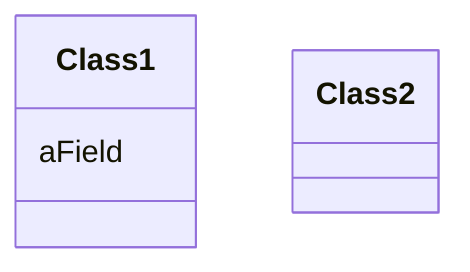
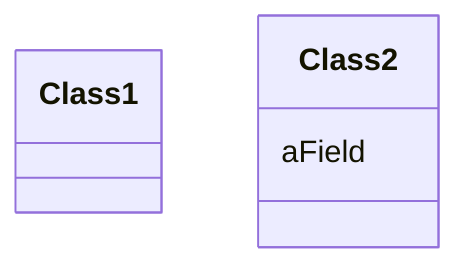

# 搬移字段

你的程序中，某个字段被其所驻类之外的另一个类更多地用到。


**在目标类新建一个字段，修改源字段的所有用户，令它们改用新字段。**





## 动机
在类之间移动状态和行为，是重构过程中必不可少的措施。随着系统发展，你 会发现自己需要新的类，并需要将现有的工作责任拖到新的类中。在这个星期看似 合理而正确的设计决策，到了下个星期可能不再正确。这没问题。如果你从来没遇
到这种情况，那才有问题。
如果我发现，对于一个字段，在其所驻类之外的另一个类中有更多函数使用了 它，我就会考虑搬移这个字段。上述所谓“使用”可能是通过设值/取值函数间接 进行的。我也可能移动该字段的用户(某个函数),这取决于是否需要保持接口不
受变化。如果这些函数看上去很适合待在原地，我就选择搬移字段。
使用Extract Class(149)时，我也可能需要搬移字段。此时我会先搬移字段，然
后再搬移函数。

## 做法
-[ ] 如果字段的访问级是public,使用Encapsulate Field (206)将它封装起来。
  >→
   如果你有可能移动那些频繁访问该字段的函数，或如果有许多函数访问某个字段，
   先使用 Self Encapsulate Field (171)也许会有帮助。
-[ ] 编译，测试。
-[ ] 在目标类中建立与源字段相同的字段，并同时建立相应的设值/取值函数。
-[ ] 编译目标类。
-[ ] 决定如何在源对象中引用目标对象。
  >→ 
   首先看是否有一个现成的字段或函数可以助你得到目标对象。
   如果没有，就看能否轻易建立这样一个函数。
   如果还不行，就得在源类中新建一个字段来存放目标对象。
   这可能是个永久性修改，但你也可以让它是暂时的，因为后续重构可能会把这个新建字段除掉。
-[ ] 删除源字段。
-[ ] 将所有对源字段的引用替换为对某个目标函数的调用。
  >→如果需要读取该变量，就把对源字段的引用替换为对目标取值函数的调用；
   如果要对该变量赋值，就把对源字段的引用替换成对设值函数的调用。  
   →如果源字段不是`private`的，就必须在源类的所有子类中查找源字段的引用点，并进行相应替换。
-[ ] 编译，测试。

## 范例

下⾯是Account类的部分代码：
```java
class Account{
    private AccountType _type;
    private double _interestRate;
    double interestForAmount_days(double amount,int days){
        return _interestRate * amount * days / 365;
    }
}
```

我想把表示利率的 _interestRate字段，搬移到 AccountType类 去。
⽬前，已有数个函数引⽤了它，interestForAmount_days() 就是其⼀。
下⼀步，我要在 AccountType类 中建⽴ _interestRate字段 以及相应的访问函数：
```java
class AccountType{
    private double _interestRate;
    void setInterestRate(double arg){
        _interestRate = arg;
    }
    double getInterestRate(){
        return _interestRate;
    }
}

```

这时候，我可以编译新的 AccountType类了。

现在，我需要让 Account类 中, 访问 _interestRate字段 的函数 转⽽使⽤AccountType对象，
然后删除Account类中的_interestRate字段。
我必须删除源字段，才能保证其访问函数的确改变了操作对象，因为编译器会帮我指出未被正确修改的函数。

```java
class Account{
    private AccountType _type;
    double interestForAmount_days(double amount,int days){
        return _type.getInterestRate() * amount * days / 365;
    }
}

```

### 使用 Self-Encapsulation

如果有很多函数已经使用了 _interestRate字段，  
我应该先运用 Self Encapsulate Field(171) (自我封装)，
封装 _interestRate字段 的读写函数:
```java
class Account{
    private AccountType _type;
    private double _interestRate;
    double interestForAmount_days(double amount,int days){
        return getInterestRate() * amount * days / 365;
    }
    private double getInterestRate(){
        return _interestRate;
    }
    private double getInterestRate(){
        return _interestRate;
    }
}

```

这样，在搬移 interestRate字段 之后，我就只需要修改访问函数 getInterestRate()：
```java
class Account{
    private AccountType _type;
    double interestForAmount_days(double amount,int days){
        return getInterestRate() * amount * days / 365;
    }
    private double getInterestRate(){
        return _type.getInterestRate();
    }
}

```

以后若有必要，我可以修改访问函数的用户，让它们使用新对象。  
SelfEncapsulate Field(171) 使我得以保持小步前进。
如果我需要对类做许多处理，保持小步前进是有帮助的。  

特别值得一提的是：
首先使用SelfEncapsulate Field(171)，使我得以更轻松使用Move Method (142)将函数搬移到目标类中。
如果待搬移函数引用了字段的访问函数，那些引用点是无需修改的。