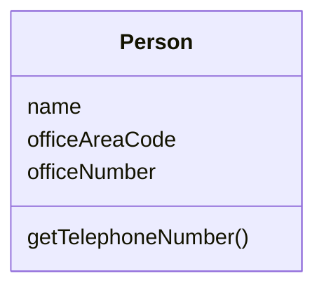
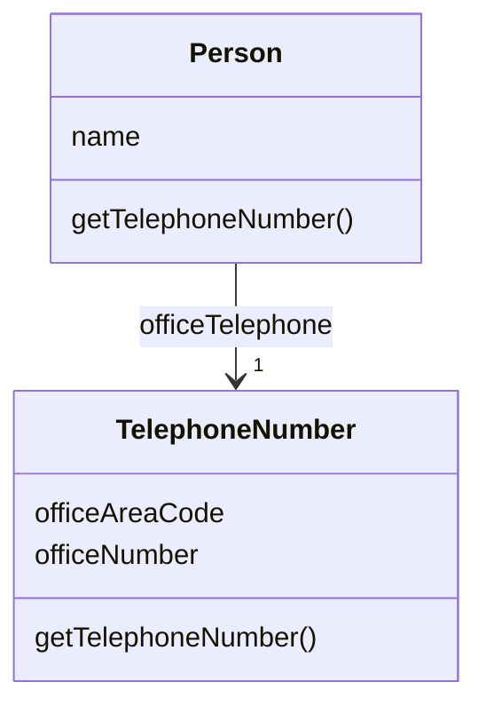

# 提炼类

某个类做了应该由两个类做的事。 

建⽴⼀个新类，将相关的宇段和函数从旧类搬移到新类。






## 动机

你也许听过类似这样的教诲：⼀个类应该是⼀个清楚的抽象，处理⼀些明确的责任。  
但是在实际⼯作中，类会不断成⻓扩展。  
你会在这⼉加⼊⼀些功能，在那⼉加⼊⼀些数据。
给某个类添加⼀项新责任时，你会觉得不值得为这项责任分离出⼀个单独的类。  
于是，随着责任不断增加，这个类会变得过分复杂。很快，你的类就 会变成⼀团乱麻。  

这样的类往往含有⼤量函数和数据。这样的类往往太⼤⽽不易理解。  
此时，你需要考虑哪些部分可以分离出去，并将它们分离到⼀个单独的类中。  
如果 某些数据 和 某些函数 总是 ⼀起出现，某些数据 经常同时变化甚⾄彼此相依，这就表示你应该将它们分离出去。  
⼀个有⽤的测试就是，问你⾃⼰，如果你搬移了某些字段和函数，会发⽣什么事？
其他字段和函数 是否因此变得⽆意义？

另⼀个往往在开发后期出现的信号是，类的⼦类化⽅式。
如果你发现⼦类化只影响类的部分特性，或 
如果你发现 某些特性 需要以⼀种⽅式来⼦类化，
         某些特性 则需要以另⼀种⽅式⼦类化，
这就意味你需要分解原来的类。


## 做法
-[ ] 决定如何分解类所负的责任。 

-[ ] 建⽴⼀个新类，⽤以表现从旧类中分离出来的责任。
  >如果旧类剩下的责任与旧类名称不符，为旧类更名。

-[ ] 建⽴“从旧类访问新类”的连接关系。
  >有可能需要⼀个双向连接。但是在真正需要它之前，不要建⽴“从新类通 往旧类”的连接。

-[ ] 对于你想搬移的每⼀个字段，运⽤ Move Field （146）搬移之。

-[ ] 每次搬移后，编译、测试。 

-[ ] 使⽤ Move Method（142）将必要函数搬移到新类。  
     先搬移，较低层函数（也就是 “被其他函数调⽤” 多于 “调⽤其他函数” 的函数）。   
     再搬移，较⾼层函数。  

-[ ] 每次搬移之后，编译、测试。 

-[ ] 检查，精简每个类的接⼝。
  >如果你建⽴起双向连接，检查是否可以将它改为单向连接。

-[ ] 决定是否公开新类。  
     如果你的确需要公开它，就要决定让它成为 ‘引⽤对象’ 还是 ‘不可变的值对象’ 。

## 范例
我们从一个简单的Person类开始：
```java
class Person {
    private String _name;
    private String _officeAreaCode;
    private String _officeNumber;

    public String getName() {
        return _name;
    }

    public String getTelephoneNumber() {
        return "(" + _officeAreaCode + ") " + _officeNumber;
    }

    String getOfficeAreaCode() {
        return _officeAreaCode;
    }

    void setOfficeAreaCode(String arg) {
        _officeAreaCode = arg;
    }

    String getOfficeNumber() {
        return _officeNumber;
    }

    void setOfficeNumber(String arg) {
        _officeNumber = arg;
    }
}

```

在这个例子中，我可以将与电话号码相关的行为分离到一个独立类中。
首先，我要定义一个 TelephoneNumber类 来表示“电话号码”这个概念：
```java
class TelephoneNumber {
}
```

易如反掌!
然后，我要建立从 Person 到 TelephoneNumber 的连接：
```java
class Person {
    private TelephoneNumber _officeTelephone = new TelephoneNumber();
    // ... 
}
```

现在，我运用 Move Field(146) 移动一个字段：
```java
class TelephoneNumber {
    private String _areaCode;
    private String _number;
    
    String getAreaCode() {
        return _areaCode;
    }

    void setAreaCode(String arg) {
        _areaCode = arg;
    }

    String getNumber() {
        return _number;
    }

    void setNumber(String arg) {
        _number = arg;
    }
}

```

```java
class Person {
    private String _name;
    private TelephoneNumber _officeTelephone = new TelephoneNumber();

    public String getName() {
        return _name;
    }

    public String getTelephoneNumber() {
        return  "(" + getOfficeAreaCode() + ") " + getOfficeNumber();
    }

    TelephoneNumber getOfficeTelephone() {
        return _officeTelephone;
    }
    
    String getOfficeAreaCode() {
        return _officeTelephone.getAreaCode();
    }
    String getOfficeNumber() {
        return _officeTelephone.getNumber();
    }
}

```


然后我可以移动其他字段，并运用Move Method(142)将相关函数移动到TelephoneNumber类中：
```java
class Person {
    private String _name;
    private TelephoneNumber _officeTelephone = new TelephoneNumber();

    public String getName() {
        return _name;
    }

    public String getTelephoneNumber() {
        return _officeTelephone.getTelephoneNumber();
    }

    TelephoneNumber getOfficeTelephone() {
        return _officeTelephone;
    }
}

class TelephoneNumber {
    private String _areaCode;
    private String _number;

    String getTelephoneNumber() {
        return "(" + _areaCode + ") " + _number;
    }

    String getAreaCode() {
        return _areaCode;
    }

    void setAreaCode(String arg) {
        _areaCode = arg;
    }

    String getNumber() {
        return _number;
    }

    void setNumber(String arg) {
        _number = arg;
    }
}

```


下一步要做的决定是：要不要对用户公开这个新类?
我可以将Person中与电话号码相关的函数委托至TelephoneNumber, 从而完全隐藏这个新类；
也可以直接将它对用户公开。我还可以将它公开给部分用户(位于同一个包中的用户)，而不公开给其他用户。

如果，我选择公开新类，就需要考虑别名带来的危险。
如果，我公开了TelephoneNumber，而有个用户 修改了对象中 的 _areaCode 字段值，我又怎么能知道呢?
而且，做出修改的可能不是直接用户，而是 用户的 用户的 用户。

面对这个问题，我有下列几种选择。

1. 允许任何对象修改 TelephoneNumber对象 的任何部分。
   这就使得 TelephoneNumber 对象 成为 引用对象，于是，我应该考虑使用 Change Value to Reference(179)。
   这种情况下，Person 应该是 TelephoneNumber 的访问点。

2. 不许任何人不通过 Person对象 就修改 TelephoneNumber对象。
   为此，我可以将 TelephoneNumber 设为不可修改的，或为它提供一个不可修改的接口。

3. 另一个办法是：先复制一个TelephoneNumber对象，然后将复制得到的新对象传递给⽤户。
   但这可能会造成⼀定程度的迷惑，因为⼈们会认为他们可以修改 TelephoneNumber 对象值。
   此外，如果同⼀个 TelephoneNumber对象 被传递给多个⽤户，也可能在⽤户之间造成别名问题。

Extract Class （149）是改善并发程序的⼀种常⽤技术，因为它使你可以为提炼后的两个类分别加锁。
如果你不需要同时锁定两个对象，就不必这样做。
这⽅⾯的更多信息请看Lea[Lea]的3.3节。

这⾥也存在危险性。如果需要确保两个对象被同时锁定，你就⾯临事务问题，需要使⽤其他类型的共享锁。
正如Lea[Lea]的8.1节所讨论的，这是⼀个复杂领域，⽐起⼀般情况需要更繁重的机制。
事务很有实⽤性，但是编写事务管理程序则超出了⼤多数程序员的职责范围。
