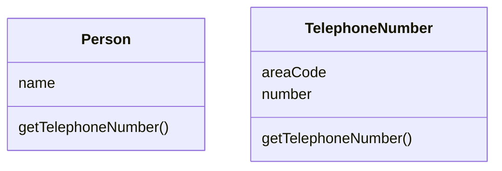
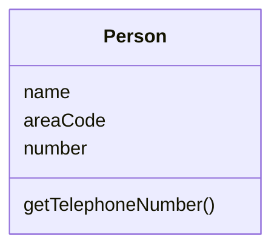

# 将类内联化
某个类没有做太多事情。 

将这个类的所有特性搬移到另⼀个类中，然后移除原类。




## 动机

Inline Class （154）正好与 Extract Class （149）相反。  
如果⼀个类不再承担⾜够责任、不再有单独存在的理由（这通常是因为此前的重构动作移⾛了这个类的责任），
我就会挑选这⼀“萎缩类”的最频繁⽤户（也是个类），以 Inline Class （154）⼿法，将“萎缩类”塞进另⼀个类中。

## 做法
-[ ] 在⽬标类身上声明源类的public协议，并将其中所有函数委托⾄源类。
  >如果“以⼀个独⽴接口表示源类函数”更合适的话，就应该在内联之前先使⽤ Extract Interface （341）
-[ ] 修改所有源类引⽤点，改⽽引⽤⽬标类。 
  >将源类声明为private，以斩断包之外的所有引⽤可能。
   同时修改源类的名称，这便可使编译器帮助你捕捉到所有对于源类的隐藏引⽤点。 
-[ ] 编译，测试。
-[ ] 运⽤ Move Method（142）和 Move Field（146），将源类的特性全部搬移到⽬标类。
-[ ] 为源类举⾏⼀个简单的“丧礼”。


## 范例

先前（上个重构项）我从TelephoneNumber提炼出另⼀个类，现在，我要将它塞回到Person去。  
⼀开始，这两个类是分离的：
```java
class Person {
    String getName() {
        return _name;
    }

    String getTelephoneNumber() {
        return _officeTelephone.getTelephoneNumber();
    }

    TelephoneNumber getOfficeTelephone() {
        return _officeTelephone;
    }

    private String _name;
    private TelephoneNumber _officeTelephone = new TelephoneNumber();
}

class TelephoneNumber {
    String getTelephoneNumber() {
        return "(" + getAreaCode() + ") " + getNumber();
    }

    String getAreaCode() {
        return _areaCode;
    }

    void setAreaCode(String arg) {
        _areaCode = arg;
    }

    String getNumber() {
        return _number;
    }

    void setNumber(String arg) {
        _number = arg;
    }

    private String _areaCode;
    private String _number;
}

```

⾸先，我在Person中，声明 TelephoneNumber 的所有 “可⻅”（public）函数：

```java
class Person {

    String getName() {
        return _name;
    }

    String getTelephoneNumber() {
        return "(" + getAreaCode() + ") " + getNumber();
    }
    
    String getAreaCode() {
        return _officeTelephone.getAreaCode();
    }

    void setAreaCode(String arg) {
        _officeTelephone.setAreaCode(arg);
    }

    String getNumber() {
        return _officeTelephone.getNumber();
    }

    void setNumber(String arg) {
        _officeTelephone.setNumber(arg);
    }

    private String _name;
    private TelephoneNumber _officeTelephone = new TelephoneNumber();
}

```

然后，我将所有对TelephoneNumber的引⽤点，改为对Person的引⽤点：
```java
class Person {
    private String _name;
    private String _officeAreaCode;
    private String _officeNumber;

    public String getName() {
        return _name;
    }
    
    String getAreaCode() {
        return _officeAreaCode;
    }
    void setAreaCode(String arg) {
        _officeAreaCode = arg;
    }

    String getNumber() {
        return _officeNumber;
    }
    void setNumber(String arg) {
        _officeNumber = arg;
    }

    public String getTelephoneNumber() {
        return "(" + getAreaCode() + ") " + getNumber();
    }

}

```


现在，我要找出TelephoneNumber的所有⽤户，让它们转⽽使⽤Person的接⼝。
于是，下列代码：
```java
public static void main(String[] args) {
    Person martin = new Person();
    martin.getOfficeTelephone().setAreaCode("781");
}
```

就变成了：
```java
public static void main(String[] args) {
    Person martin = new Person();
    martin.setAreaCode("781");
}
```

现在，我可以反复使⽤ Move Method （142）和 Move Field （146）， 直到 TelephoneNumber 不复存在。