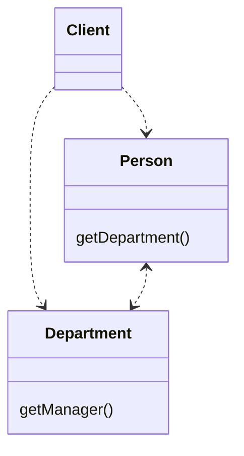
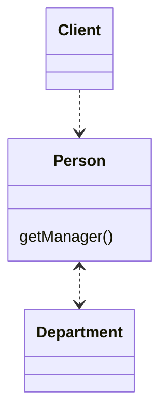
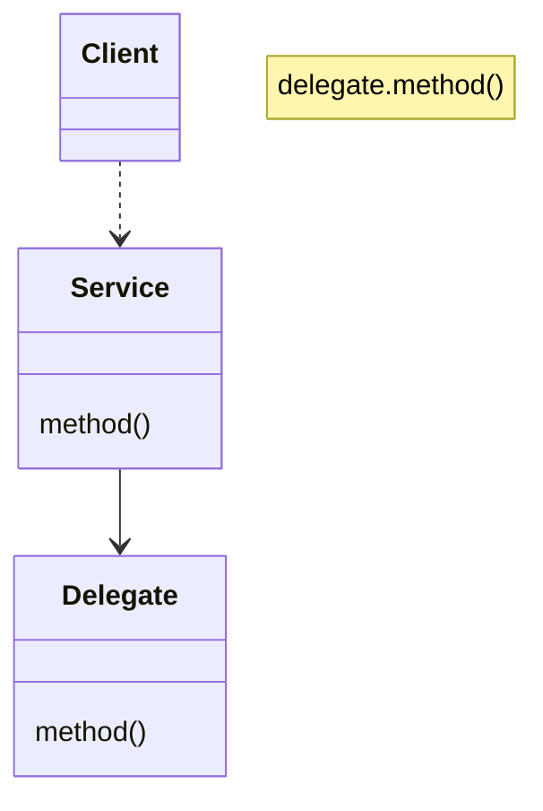

# 隐藏“委托关系”
客户通过⼀个委托类来调⽤另⼀个对象。 

**在服务类上，建⽴客户所需的所有函数，⽤以隐藏委托关系。**






## 动机

“封装”，即使不是对象的最关键特征，也是最关键特征之⼀。
“封装”意味每个对象都应该尽可能少了解系统的其他部分。
如此⼀来，⼀旦发⽣变化，需要了解这⼀变化的对象就会⽐较少————这会使变化⽐较容易进⾏。 

任何学过对象技术的⼈都知道：虽然Java允许将字段声明为public，但你还是应该隐藏对象的字段。
随着经验⽇渐丰富，你会发现，有更多可以（⽽且值得）封装的东⻄。

如果某个客户先通过服务对象的字段得到另⼀个对象，然后调⽤后者的函数，那么，客户就必须知晓这⼀层委托关系。
万⼀委托关系发⽣变化，客户也得相应变化。 
你可以在服务对象上放置⼀个简单的委托函数，将委托关系隐藏起来，从⽽去除这种依赖（图7-1）。
这么⼀来，即便将来发⽣委托关系上的变化，变化也将被限制在服务对象中，不会波及客户。



对于某些或全部客户，你可能会发现，有必要先使⽤ Extract Class （149）。
⼀旦你对所有客户都隐藏了委托关系，就不再需要在服务对象的接⼝中公开被委托对象了。

## 做法

-[ ] 对于每⼀个委托关系中的函数，在服务对象端建⽴⼀个简单的委托函数。 
-[ ] 调整客户，令它只调⽤服务对象提供的函数。
•如果使⽤者和服务提供者不在同⼀个包，考虑修改委托函数的访问权限，让客户得以在包之外调⽤它.

-[ ] 每次调整后，编译并测试。 
-[ ] 如果将来不再有任何客户需要取⽤ 图7-1 的Delegate（受托类），便可移除服务对象中的相关访问函数。 
-[ ] 编译，测试。

## 范例

本例从两个类开始：代表“⼈”的 Person 和 代表“部⻔”的 Department：

```java
class Person {
    Department _department;
    
    public Department getDepartment() {
        return _department;
    }
    
    public void setDepartment(Department arg) {
        _department = arg;
    }
}

class Department {
    private String _chargeCode;
    private Person _manager;
    public Department(Person manager) {
        _manager = manager;
    }
    
    public Person getManager() {
        return _manager;
    }

    public String getChargeCode() {
        return _chargeCode;
    }

    public void setChargeCode(String _chargeCode) {
        this._chargeCode = _chargeCode;
    }
}

```

如果客户希望知道某⼈的经理是谁，他必须先取得Department对象：

`manager = john.getDepartment().getManager();`

这样的编码就是对客户揭露了Department的⼯作原理，于是客户知道：Department⽤以追踪“经理”这条信息。
如果对客户隐藏Department，可以减少耦合。 
为了这⼀⽬的，我在Person中建⽴⼀个简单的委托函数：

```java
class Person {
    Department _department;
    
    public void setDepartment(Department arg) {
        _department = arg;
    }
    
    public Person getManager() {
        return _department.getManager();
    }
}

```

现在，我得修改Person的所有客户，让它们改⽤新函数：

`manager = john.getManager();`

只要完成了对 Department 所有函数的委托关系，并相应修改了 Person 的所有客户，
我就可以移除 Person 中的 访问函数 getDepartment()了。