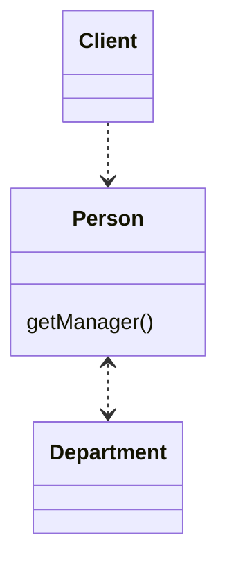
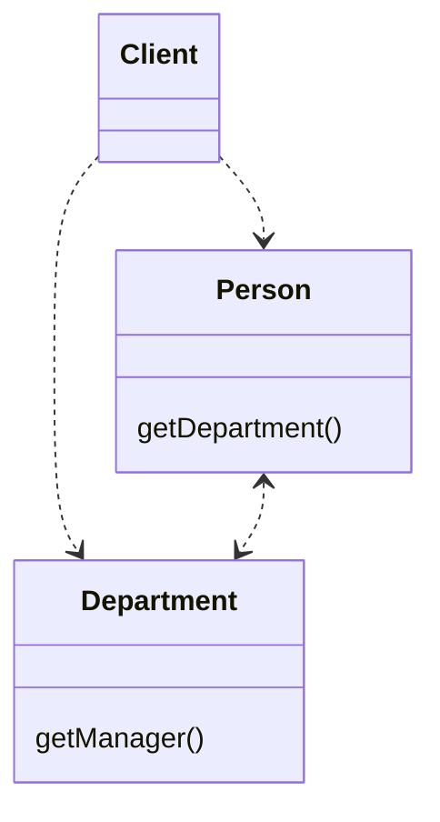

# 移除中间⼈

某个类做了过多的简单委托动作。 

让客户直接调⽤受托类。





## 动机
在 Hide Delegate（157）的“动机”⼀节中，我谈到了“封装受托对象”的好处。
但是这层封装也是要付出代价的，它的代价就是：
每当客户要使⽤受托类的新特性时，你就必须在服务端添加⼀个简单委托函数。
随着受托类的特性（功能）越来越多，这⼀过程会让你痛苦不已。
服务类完全变成了⼀个“中间⼈”，此时你就应该让客户直接调⽤受托类。

很难说什么程度的隐藏才是合适的。
还好，有了Hide Delegate （157）和 Remove Middle Man （160），
你⼤可不必操⼼这个问题，因为你可以在系统运⾏过程中不断进⾏调整。
随着系统的变化，“合适的隐藏程度”这个尺度也相应改变。
6个⽉前恰如其分的封装，现今可能就显得笨拙。
重构的意义就在于：你永远不必说对不起————只要把出问题的地⽅修补好就⾏了。

## 做法
-[ ] 建⽴⼀个函数，⽤以获得受托对象。 
-[ ] 对于每个委托函数，在服务类中删除该函数，并让需要调⽤该函数的客户转 为调⽤受托对象。 
-[ ] 处理每个委托函数后，编译、测试。

范例

我将以另⼀种⽅式使⽤先前⽤过的“⼈与部⻔”例⼦。
还记得吗，上⼀项重构结束时，Person 将 Department 隐藏起来了：

```java

class Person {
    Department _department;

    public void setDepartment(Department arg) {
        _department = arg;
    }

    public Person getManager() {
        return _department.getManager();
    }
}

class Department {
    private String _chargeCode;
    private Person _manager;

    public Department(Person manager) {
        _manager = manager;
    }

    public Person getManager() {
        return _manager;
    }

    public String getChargeCode() {
        return _chargeCode;
    }

    public void setChargeCode(String _chargeCode) {
        this._chargeCode = _chargeCode;
    }
}

```

为了找出某⼈的经理，客户代码可能这样写：

`manager = john.getManager();`

像这样，使⽤和封装Department都很简单。
但如果⼤量函数都这么做，我就不得不在Person之中安置⼤量委托⾏为。
这就该是移除中间⼈的时候了。⾸先，在Person中建⽴⼀个函数，⽤于获得受托对象：
```java
class Person {
    Department _department;

    public Department getDepartment() {
        return _department;
    }

    public void setDepartment(Department arg) {
        _department = arg;
    }
}

```

然后，逐⼀处理每个委托函数。
针对每⼀个这样的函数，我要找出通过Person 使⽤的函数，并对它进⾏修改，使它⾸先获得受托对象，然后直接使⽤后者：

`manager = john.getDepartment().getManager();`

然后，我就可以删除 Person 的 getManager()函数。
如果我遗漏了什么，编译器会告诉我。

为⽅便起⻅，我也可能想要保留⼀部分委托关系。
此外，我也可能希望对某些客户隐藏委托关系，并让另⼀些⽤户直接使⽤受托对象。
基于这些原因，⼀些简单的委托关系（以及对应的委托函数）也可能被留在原地。