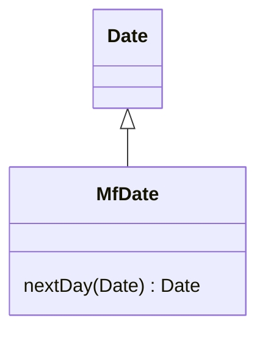
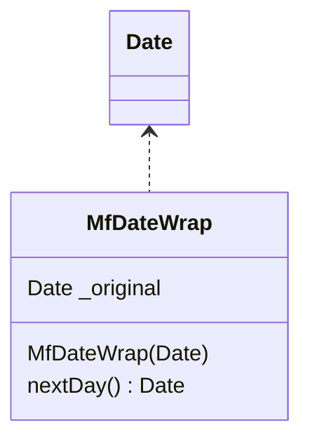

# 引入本地扩展

你需要为服务类提供一些额外函数，但你无法修改这个类。


建立一个新类，使它包含这些额外函数。
让这个 “扩展品” 成为： “源类”的 “子类” 或 “包装类”。

引入外加函数：


方式一，子类化：


方式二，包装类：


## 动机
很遗憾，类的作者无法预知未来，他们常常没能为你预先准备一些有用的函数。
如果你可以修改源码，最好的办法就是直接加入自己需要的函数。  
但你经常无法修改源码。如果只需要一两个函数，你可以使用 Introduce Foreign Method（162）。  
但如果你需要的额外函数超过两个，外加函数就很难控制它们了。
所以，你需要将这些函数组织在一起，放到一个恰当地方去。
要达到这一目的，两种标准对象技术——— 子类化（subclassing）和 包装（wrapping），是显而易见的办法。  
这种情况下，我把 ‘子类’ 或 ‘包装类’ 统称为 **‘本地扩展 （local extension）’**。

所谓本地扩展，是一个独立的类，但也是被扩展类的子类型：
它提供‘源类’的一切特性，同时额外添加新特性。
在任何使用源类的地方，你都可以使用本地扩展取而代之。

使用本地扩展，使你得以坚持“函数和数据应该被统一封装”的原则。
如果，你一直把本该放在扩展类中的代码，零散地放置于其他类中，
最终，只会让其他这些类变得过分复杂，并使得其中函数难以被复用。

在 **子类** 和 **包装类** 之间做选择时，我通常首选 **子类**，因为这样的工作量比较少。 
制作子类的最大障碍在‘子’，它必须在 对象‘创建期’ 实施。  
如果，我可以接管对象创建过程，那当然没问题：但如果，你想在对象创建之后 再使用 本地扩展，就有问题了。  
此外，子类化方案还必须产生一个子类对象，这种情况下，如果有其他对象引用了旧对象，我们就同时有两个对象保存了原数据！  
如果，原数据是不可修改的，那也没问题，我可以放心进行复制；
但如果，原数据允许被修改，问题就来了，因为一个修改动作无法同时改变两份副本。  
这时候，我就必须改用包装类。  
使用包装类时，对本地扩展的修改会波及原对象，反之亦然。

## 做法
-[ ] 建立一个扩展类，将它作为原始类的子类或包装类。
-[ ] 在扩展类中加入转型构造函数。
   >→所谓“转型构造函数”是指“接受原对象作为参数”的构造函数。
     如果采用子类化方案，那么转型构造函数应该调用适当的超类构造函数；
     如果采用包装类方案，那么转型构造函数应该将它得到的传入参数，以实例变量的形式保存起来，用作接受委托的原对象。
-[ ] 在扩展类中加入新特性。
-[ ] 根据需要，将原对象替换为扩展对象。
-[ ] 将针对原始类定义的所有外加函数搬移到扩展类中。


## 范例
### 概述
我将以Java 1.0.1 的 Date类 为例。
Java1.1 已经提供了我想要的功能，但是在它到来之前的那段日子，很多时候，我需要扩展 Java 1.0.1 的 Date 类。
第一件 待决事项 就是：使用 子类 还是 包装类。

1、子类化，是比较显而易见的办法：
```java
class MfDateSub extends Date {
    public  MfDateSub nextDay(){
        // ...
    }
    public  int dayOfYear(){
        // ...
    }
}
```

2、包装类，则需用上委托：
```java
class MfDateWrap {
    private Date _original;
}
```

### 范例：使用子类
首先，我要新建立一个 MfDateSub类，来表示“日期”，并使其成为 Date 的子类：
```java
class MfDateSub extends Date {
    // ...
}
```

然后，我需要处理 Date 和 扩展类 之间的不同处。
MfDateSub 构造函数，需要委托给 Date 构造函数：
```java
class MfDateSub extends Date {
    public MfDateSub(String dateString){
        super(dateString);
    }
}
```

现在，我需要加入一个转型构造函数，其参数是一个 源类 的对象：
```java
class MfDateSub extends Date {
    public MfDateSub(Date arg){
        super(arg.getTime());
    }
}
```

现在，我可以在 扩展类 中添加新特性，并使用 Move Method (142)，将所有 外加函数 搬移到 扩展类。
于是，下面搬迁前的代码：
```java
class client {
    private static Date nextDay(Date arg) {
        //foreign method,should be on date
        return new Date(arg.getYear(), arg.getMonth(), arg.getDate() + 1);
    }
}
```
经过搬移之后，就成了：
```java
class MfDateSub {
    Date nextDay() {
       return new Date(getYear(),getMonth(),getDate()+1);
    }
}

```

### 范例：使用包装类
首先声明一个包装类：
```java
class MfDateWrap {
    private Date _original;
}
```

使用包装类方案时，我对构造函数的设定，与先前有所不同。
现在的构造函数，将只执行一个单纯的委托动作：
```java
class MfDateWrap {
    private Date _original;
    public MfDateWrap(String dateString) {
        _original = new Date(dateString);
    }
}
```
① Mf 是作者 Martin Fowler 的姓名缩写。  — — 译者注


而转型构造函数，则只是对其实例变量赋值而已：
```java
class MfDateWrap {
    private Date _original;
    public MfDateWrap(Date arg){
        _original = arg;
    }
}
```

接下来是一项枯燥乏味的工作：为原始类的所有函数提供委托函数。
我只展示两个函数，其他函数的处理依此类推。
```java
class MfDateWrap {
    private Date _original;
    
    public MfDateWrap(Date arg){
        _original = arg;
    }

    public int getYear() {
        return _original.getYear();
    }

    public boolean equals(Object arg) {
        if (this == arg)
            return true;
        if (!(arg instanceof MfDatewrap))
            return false;
        MfDateWrap other = ((MfDateWrap) arg);
        return (_original.equals(other._original));
    }
}

```

完成这项工作之后，我就可以后使用 Move Method (142) 将日期相关行为搬移到新类中。
于是，以下搬迁前代码：
```java
class client {
    private static Date nextDay(Date arg) {
        // foreign method,should be on date
        return new Date(
                arg.getYear(), 
                arg.getMonth(), 
                arg.getDate() + 1);
    }
}

```

经过搬移之后，就成了:
```java
class MfDateWrap {
    Date nextDay(){
        return new Date(
                getYear(),
                getMonth(),
                getDate() + 1);
    }
}

```

使用包装类有一个特殊问题：如何处理 “接受原始类之实例为参数”的函数?
例如：
```java
 public boolean after(Date arg){
    // ...
 }
```

由于无法改变原始类，所以，我只能做到在一个方向上的兼容————  
    包装类 上的 after() 函数，可以接受 包装类 或 原始类的对象；
但，原始类 的 after() 函数，只能接受 原始类对象，不接受 包装类对象；
```java
public void test(){
    Date aDate = new Date();
    MfDateWrap aWrapper = new MfDateWrap(aDate);
    MfDateWrap anotherWrapper = new MfDateWrap(new Date());
    
    // 包装类 上的 after() 函数，可以接受 包装类的对象 或 原始类的对象；  
    // can be made to work
    aWrapper.after(aDate);
    aWrapper.after(anotherWrapper);
    
    // 原始类 的 after() 函数，只能接受 原始类对象， 不接受 包装类对象
    // will not work
    aDate.after(aWrapper);
}
```

这样覆写的目的，是为了向用户隐藏 包装类 的存在。
这是一个好策略，因为包装类的用户的确不应该关心包装类的存在，的确应该可以同样地对待 包装类 和 原始类。
但是，我无法完全隐藏包装类的存在，因为，某些系统所提供的函数(例如，equals())会出问题。
你可能会认为：你可以在 MfDateWrap类 中覆写equals(), 像这样：
`public boolean equals(Date arg)  // causes problems`
但这样做是危险的，
因为，尽管我达到了自己的目的，但Java系统的其他部分都认为 equals() 符合 交换律：
如果 `a.equals(b)` 为真，那么 `b.equals(a)`也必为真。  
违反这一规则，将使我遭遇一大堆莫名其妙的错误。
要避免这样的尴尬境地，唯一办法就是修改 Date 类。
但如果我能够修改Date, 又何必进行此项重构?
所以，在这种情况下，我只能向用户公开“我进行了包装”这一事实。
我将以一个新函数来进行日期之间的相等性检查：
`public boolean equalsDate(Date arg)`

我可以重载equalsDate(), 让一个重载版本接受 Date 对象，另一个重载版本接受 MfDateWrap 对象。
这样我就不必检查未知对象的类型了：
`public boolean equalsDate(MfDateWrap arg)`

子类化方案中就没有这样的问题，只要我不覆写原函数就行了。
但，如果我覆写了原始类中的函数，那么，寻找函数时，就会被搞得晕头转向。 
一般来说，我不会在扩展类中覆写原始类的函数，只会添加新函数。

