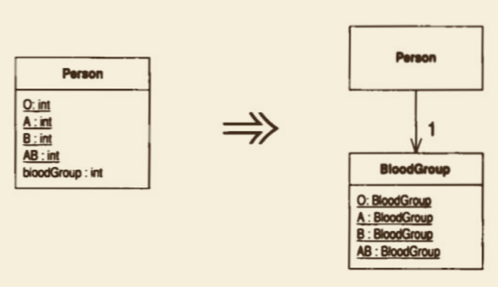
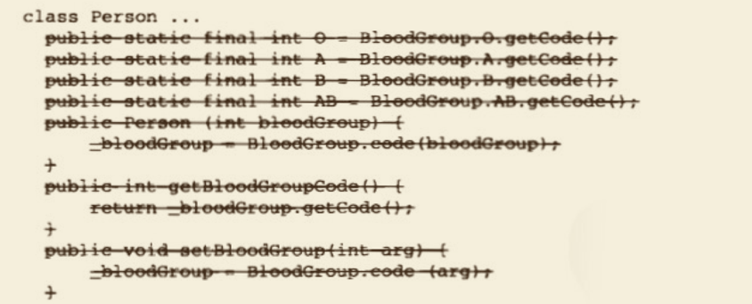

# Replace Type Code with Class（以类取代类型码）

类之中有⼀个数值类型码，但它并不影响类的⾏为。

以⼀个新的类替换该数值类型码。




## 动机

在以C为基础的编程语⾔中，类型码 或 枚举值 很常⻅。

如果带着⼀个有意义的符号名，类型码的可读性还是不错的。
问题在于，符号名终究只是个别名，编译器看⻅的、进⾏类型检验的，还是背后那个数值。
任何接受类型码作为参数的函数，所期望的实际上是⼀个数值，⽆法强制使⽤符号名。
这会⼤⼤降低代码的可读性，从⽽成为bug之源。

如果把那样的数值换成⼀个类，编译器就可以对这个类进⾏类型检验。
只要为这个类提供⼯⼚函数，你就可以始终保证只有合法的实例才会被创建出来，⽽且它们都会被传递给正确的宿主对象。
但是，在使⽤ Replace Type Code with Class （218）之前，你应该先考虑类型码的其他替换⽅式。
只有当类型码是纯粹数据时（也就是 类型码 不会在switch语句中引起⾏为变化时），你才能以类来取代它。
Java 只能以整数作为switch语句的判断依据，不能使⽤任意类，因此，那种情况下不能够以类替换类型码。
更重要的是：任何 switch语句都应该运⽤ Replace Conditional with Polymorphism （255）去掉。
为了进⾏那样的重构，你⾸先必须运⽤ Replace Type Code with Subclasses （223）或 Replace Type Code with State/Strategy （227），把类型码处理掉。 
即使，⼀个类型码 不会因其数值的不同 ⽽引起 ⾏为上的差异，宿主类中的某些⾏为还是有可能更适合置放于类型码类中，
因此，你还应该留意是否有必要使⽤Move Method （142）将⼀两个函数搬过去。


## 做法

-[ ] 为类型码建⽴⼀个类。
>这个类需要⼀个⽤以记录类型码的字段，其类型应该和类型码相同，并应 该有对应的取值函数。此外还应该⽤⼀组静态变量保存允许被创建的实 例，并以⼀个静态函数根据原本的类型码返回合适的实例.

-[ ] 修改源类实现，让它使⽤上述新建的类。 
>维持原先以类型码为基础的函教接⼝，但改变静态字段，以新建的类产⽣ 代码。
 然后，修改类型码相关函数，让它们也从新建的类中荻取类型码。 

-[ ] 编译，测试。
> 此时，新建的类可以对类型码进⾏运⾏期检查。 

-[ ] 对于源类中每⼀个使⽤类型码的函数，相应建⽴⼀个函数，让新函数使⽤新建的类。
>你需要建⽴“以新类实例为⾃变量”的函数，⽤以替換原先“直接以类型 码为参数”的函数。
你还需要建⽴⼀个“返回新类实例”的函数，⽤以替換原先“直接返回类型码”的函数。
> 建⽴新函数前，你可以使⽤Rename Method （273）修改原函數名称，明确指出哪些函數仍然使⽤旧式的类型码，
这往往是个明智之举。 

-[ ] 逐⼀修改源类⽤户，让它们使⽤新接口。

-[ ] 每修改⼀个⽤户，编译并测试。
>你也可能需要⼀次性修改多个彼此相关的函数，才能保持这些函数之间的 ⼀致性，才能顺利地编译，测试。

-[ ] 删除使⽤类型码的旧接⼝，并删除保存旧类型码的静态变量。 
-[ ] 编译，测试。


## 范例

每个⼈都拥有四种⾎型中的⼀种。我们以 Person 来表示“⼈”，以其中的类型码表示 “⾎型”：

```java
class Person{
    public static final int O = 0;
    public static final int A = 1;
    public static final int B = 2;
    public static final int AB = 3;
    private int _bloodGroup;
    public Person(int bloodGroup){
        _bloodGroup = bloodGroup;
    }
    public void setBloodGroup(int arg){
        _bloodGroup = arg;
    }
    public int getBloodGroup(){
        return _bloodGroup;
    }
}

```


⾸先，我建⽴⼀个新的 BloodGroup 类，⽤以表示“⾎型”，并在这个类实例中，保存原本的类型码数值：
```java
class BloodGroup{
    public static final BloodGroup O = new BloodGroup(0);
    public static final BloodGroup A = new BloodGroup(1);
    public static final BloodGroup B = new BloodGroup(2);
    public static final BloodGroup AB = new BloodGroup(3);
    private static final BloodGroup[] _values = {O, A, B, AB};
    private final int _code;
    private BloodGroup(int code){
        _code = code;
    }
    public int getCode(){
        return _code;
    }
    public static BloodGroup code(int arg){
        return _values[arg];
    }
}

```

然后，我把 Person中的类型码，改为使⽤ BloodGroup类：

```java
class Person{
    public static final int O = BloodGroup.O.getCode();
    public static final int A = BloodGroup.A.getCode();
    public static final int B = BloodGroup.B.getCode();
    public static final int AB = BloodGroup.AB.getCode();
    private BloodGroup _bloodGroup;
    public Person(int bloodGroup){
        _bloodGroup = BloodGroup.code(bloodGroup);
    }
    public int getBloodGroup(){
        return _bloodGroup.getCode();
    }
    public void setBloodGroup(int arg){
        _bloodGroup = BloodGroup.code(arg);
    }
}
```

现在，我因为 BloodGroup类 ⽽拥有了运⾏期检验能⼒。
为了真正从这些改变中获利，我还必须修改Person的⽤户，让它们以BloodGroup对象表示类型码，⽽不再使⽤整数。

⾸先，我使⽤ Rename Method （273）修改类型码访问函数的名称，说明当前情况：
```java
class Person{
    public static final int O = BloodGroup.O.getCode();
    public static final int A = BloodGroup.A.getCode();
    public static final int B = BloodGroup.B.getCode();
    public static final int AB = BloodGroup.AB.getCode();
    private BloodGroup _bloodGroup;
    public Person(int bloodGroup){
        _bloodGroup = BloodGroup.code(bloodGroup);
    }
    // Rename Method 
    public int getBloodGroupCode(){
        return _bloodGroup.getCode();
    }
    public void setBloodGroup(int arg){
        _bloodGroup = BloodGroup.code(arg);
    }
}

```

然后我为Person加⼊⼀个新的取值函数，其中使⽤ BloodGroup：

```java
class Person{
    public static final int O = BloodGroup.O.getCode();
    public static final int A = BloodGroup.A.getCode();
    public static final int B = BloodGroup.B.getCode();
    public static final int AB = BloodGroup.AB.getCode();
    private BloodGroup _bloodGroup;
    public Person(int bloodGroup){
        _bloodGroup = BloodGroup.code(bloodGroup);
    }
    // Rename Method 
    public int getBloodGroupCode(){
        return _bloodGroup.getCode();
    }
    public void setBloodGroup(int arg){
        _bloodGroup = BloodGroup.code(arg);
    }
    // New Method
    public BloodGroup getBloodGroup(){
        return _bloodGroup;
    }
}
```

另外，我还要建⽴新的 构造函数 和 设值函数，让它们也使⽤ BloodGroup：

```java
class Person{
    public static final int O = BloodGroup.O.getCode();
    public static final int A = BloodGroup.A.getCode();
    public static final int B = BloodGroup.B.getCode();
    public static final int AB = BloodGroup.AB.getCode();
    private BloodGroup _bloodGroup;
    // New Constructor
    public Person(BloodGroup bloodGroup){
        _bloodGroup = bloodGroup;
    }
    public Person(int bloodGroup){
        _bloodGroup = BloodGroup.code(bloodGroup);
    }
    // Rename Method 
    public int getBloodGroupCode(){
        return _bloodGroup.getCode();
    }
    public void setBloodGroup(int arg){
        _bloodGroup = BloodGroup.code(arg);
    }
    // New Method
    public BloodGroup getBloodGroup(){
        return _bloodGroup;
    }
    // New Method
    public void setBloodGroup(BloodGroup arg){
        _bloodGroup = arg;
    }
}

```

现在，我要继续处理Person⽤户。
此时应该注意，每次只处理⼀个⽤户，这样才可以保持⼩步前进。
每个⽤户需要的修改⽅式可能不同，这使得修改过程更加棘⼿。
对Person内的静态变量的所有引⽤点也需要修改。
因此，下列代码：
`Person thePerson = new Person(Person.A)`

就变成了：
`Person thePerson = new Person(BloodGroup.A);`

原来，调⽤取值函数的代码必须改为调⽤ BloodGroup 的取值函数。
因此，下列代码：
`thePerson.getBloodGroupCode()`
变成了：
`thePerson.getBloodGroup().getCode()`

设值函数也⼀样。
因此，下列代码：
`thePerson.setBloodGroup(Person.AB)`

变成了：
`thePerson.setBloodGroup(BloodGroup.AB)`

修改完毕Person的所有⽤户之后，我就可以删掉原本使⽤整数类型的那些旧的 取值函数、构造函数、静态变量和设值函数了：


我还可以将 BloodGroup中，使⽤ 整数类型 的函数 ，声明为 private，因为再没有⼈会使⽤它们了：

```java
class BloodGroup{
    public static final BloodGroup O = new BloodGroup(0);
    public static final BloodGroup A = new BloodGroup(1);
    public static final BloodGroup B = new BloodGroup(2);
    public static final BloodGroup AB = new BloodGroup(3);
    private static final BloodGroup[] _values = {O, A, B, AB};
    private final int _code;
    private BloodGroup(int code){
        _code = code;
    }
    
    // ...
    
    private int getCode(){
        return _code;
    }
    private static BloodGroup code(int arg){
        return _values[arg];
    }
}
```

