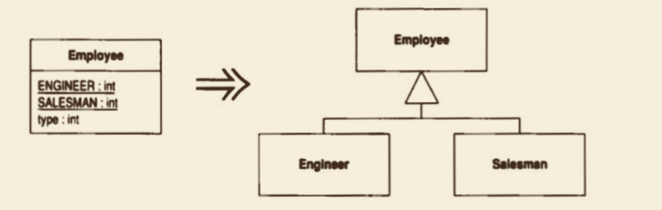

Replace Type Code with Subclasses （以⼦类取代类型码）


你有⼀个不可变的类型码，它会影响类的⾏为。

以⼦类取代这个类型码。



## 动机

如果你⾯对的 类型码 不会影响 宿主类 的⾏为，可以使⽤ Replace Type Code with Class （218）来处理它们。

但如果 类型码 会影响 宿主类 的⾏为，那么最好的办法就是借助 **多态** 来处理变化⾏为。
⼀般来说，这种情况的标志就是像 switch 这样的条件表达式。
这种条件表达式可能有两种表现形式：switch语句 或者 if-then-else结构。
不论哪种形式，它们都是检查类型码值，并根据不同的值执⾏不同的动作。

这种情况下，你应该以 Replace Conditional with Polymorphism （255）进⾏重构。
但为了能够顺利进⾏那样的重构，⾸先应该将类型码替换为可拥有多态⾏为的维承体系。
这样的⼀个继承体系应该以类 型码的宿主类为基类，并针对每⼀种类型码各建⽴⼀个⼦类。

为建⽴这样的继承体系，最简单的办法就是 Replace Type Code with Subclasses （223）：
以 类型码 的 宿主类 为基类，针对每种 类型码 建⽴相应的⼦类。 

但是以下两种情况你不能那么做：
（1）类型码 值在对象创建之后发⽣了改变；
（2）由于某些原因，类型码 宿主类 已经有了 ⼦类。
如果你恰好⾯临这两种情况之⼀，就需要使⽤ Replace Type Code with State/Strategy （227）。

Replace Type Code with Subclasses（223）的主要作⽤其实是搭建⼀个舞台，让 Replace Conditional with Polymorphism（255）得以⼀展身⼿。
如果宿主类中并没有出现条件表达式，那么 Replace Type Code with Class （218）更合适，⻛险也⽐较低。
使⽤ Replace Type Code with Subclasses （223）的另⼀个原因就是，宿主类中出现了“只与具备特定类型码之对象相关”的特性。
完成本项重构之后，你可以使⽤ Push Down Method （328）和 Push Down Field （329）将这些特性推到合适的⼦类去，
以彰显它们只与特定情况相关这⼀事实。

Replace Type Code with Subclasses （223）的好处在于：它把“对不同⾏为的了解” 从 类⽤户 那⼉转移到了 类⾃身。
如果需要再加⼊新的⾏为变化，只需添加⼀个⼦类就⾏了。
如果没有多态机制，就必须找到所有条件表达式，并逐⼀修改它们。
因此，如果未来还有可能加⼊新⾏为，这项重构将特别有价值。

## 做法

⼝ 使⽤Self Encapsulate Field （171）将类型码⾃我封装起来。

• 如果类型码被传递给构造函数，就需要将构造函教换成⼯⼚函数。 

⼝ 为类型码的每⼀个数值建⽴⼀个相应的⼦类。在每个⼦类中覆写类型码的取值函数，使其返回相应的类型码值。

• 这个值被硬编码于return句中（例如，return 1）。这看起来很肮脏，但只是权宜之计。
当所有case⼦句都被替换后，问题就解决了.

⼝ 每建⽴⼀个新的⼦类，编译并测试。 
⼝ 从超类中删掉保存类型码的字段。将类型码访问函数声明为抽象函数。 
⼝ 编译，测试。

## 范例

为简单起⻅，我还是使⽤那个恼⼈⼜不切实际的“座员/薪资”例⼦。
我们以 Employee表示“雇员”；

```java
class Employee {
    private int _type;
    static final int ENGINEER = 0;
    static final int SALESMAN = 1;
    static final int MANAGER = 2;

    Employee(int type) {
        _type = type;
    }
}

```


第⼀步是以 Self Encapsulate Field （171）将类型码⾃我封装起来：
```java
class Employee {
    private int _type;
    static final int ENGINEER = 0;
    static final int SALESMAN = 1;
    static final int MANAGER = 2;

    Employee(int type) {
        _type = type;
    }
    
    // 将类型码⾃我封装起来
    int getType() {
        return _type;
    }
}

```

由于Employee构造函数接受类型码作为⼀个参数，所以我必须将它替换为⼀个⼯⼚函数：
```java
class Employee {
    private int _type;
    static final int ENGINEER = 0;
    static final int SALESMAN = 1;
    static final int MANAGER = 2;

    // 将类型码⾃我封装起来
    int getType() {
        return _type;
    }

    // 将构造函数替换为⼀个⼯⼚函数
    static Employee create(int type) {
        return new Employee(type);
    }
}

```


现在，我可以先建⽴⼀个⼦类Engineer表示“⼯程师”。
⾸先我建⽴这个⼦类， 并在其中覆写类型码取值函数：

```java
class Engineer extends Employee {
    int getType() {
        return Employee.ENGINEER;
    }
}
```

同时，我应该修改⼯⼚函数，令它返回⼀个合适的对象：
```java
static Employee create(int type) {
    if (type == ENGINEER) 
        return new Engineer();
    else 
        return new Employee(type);
}

```

然后，我继续逐⼀地处理其他类型码，直到所有类型码都被替换成⼦类为⽌。 
此时，我就可以移除 Employee中 保存 类型码的字段，并将 getType()声明为⼀个抽象函数。
现在，⼯⼚函数看起来像这样：
```java

abstract int getType();

static Employee create(int type) {
    return switch (type) {
        case ENGINEER -> new Engineer();
        case SALESMAN -> new Salesman();
        case MANAGER -> new Manager();
        default -> throw new IllegalArgumentException("Incorrect type code value");
    };
}
```

当然，我总是避免使⽤ switch语句。
但这⾥只有⼀处⽤到 switch语句，并且只⽤于决定创建何种对象，这样的switch语句是可以接受的。

很⾃然地，在建⽴了这些⼦类之后，你就应该使⽤ Push Down Method （328）和 Push Down Field （329），
将只与特定种类雇员相关的函数和字段推到相关的⼦类去。
