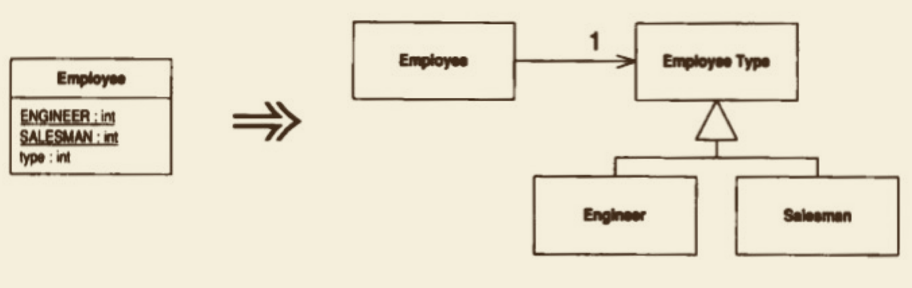

# Replace Type Code with State/Strategy（以 State/Strategy 取代类型码）

你有⼀个类型码，它会影响类的⾏为，但你⽆法通过继承⼿法消除它。 


以状态对象取代类型码。


## 动机

本项重构和 Replace Type Code with Subclasses（223）很相似，但如果“类型码的值在对象⽣命期中发⽣变化”或“其他原因使得宿主类不能被继承”，
你也可以使⽤本重构。

本重构使⽤ State模式 或 Strategy模式［Gang of Four］。

State模式 和 Strategy模式 ⾮常相似，因此⽆论你选择其中哪⼀个，重构过程都是相同的。

“选择哪⼀个模式”并⾮问题关键所在，你只需要选择更适合特定情境的模式就⾏了。
如果你打算在完成本项重构之后再以 Replace Conditional with Polymorphism （255）简化⼀个算法，那么选择 Strategy模式 ⽐较合适；
如果你打算搬移与状态相关的数据，⽽且你把新建对象视为⼀种变迁状态，就应该选择使⽤ State 模式。

## 做法

⼝ 使⽤Self Encapsulate Field （171）将类型码⾃我封装起来。

⼝ 新建⼀个类，根据类型码的⽤途为它命名。这就是⼀个状态对象。 
⼝ 为这个新类添加⼦类，每个⼦类对应⼀种类型码。 
•⽐起逐⼀添加，⼀次性加⼊所有必要的⼦类可能更简单些. 

⼝ 在超类中建⽴⼀个抽象的查询函数，⽤以返回类型码。在每个⼦类中覆写该 函数，返回确切的类型码。
⼝ 编译。
⼝ 在源类中建⽴⼀个字段，⽤以保存新建的状态对象。
⼝ 调整源类中负责查询类型码的函数，将查询动作转发给状态对象。 
⼝ 调𤦂源类中为类型码设值的函数，将⼀个恰当的状态对象⼦类赋值给“保存 状态对象”的那个字段。
⼝ 编译，测试。

## 范例

和上⼀项重构⼀样，我仍然使⽤这个既⽆聊⼜弱智的“雇员/薪资”例⼦。  
同样地，我以Employee表示“雇员”；
```java
class Employee {
       
    private int _type;
    static final int ENGINEER = 0;
    static final int SALESMAN = 1;
    static final int MANAGER = 2;

    Employee(int type) {
        setType(type);
    }

    int getType() {
        return _type;
    }

    void setType(int arg) {
        _type = arg;
    }

    // 下⾯的代码展示使⽤这些类型码的条件表达式：
    int payAmount() {
        switch (getType()) {
            case ENGINEER:
                return _monthlySalary;
            case SALESMAN:
                return _monthlySalary + _commission;
            case MANAGER:
                return _monthlySalary + _bonus;
            default:
                throw new RuntimeException("Incorrect Employee");
        }
    }
}
```

假设这是⼀家激情四溢、积极进取的公司，他们可以将表现出⾊的⼯程师擢升为经理。
因此，对象的类型码是可变的，所以我不能使⽤继承⽅式来处理类型码。
和以前⼀样，我的第⼀步还是使⽤ SelfEncapsulate Field （171）将 **表示类型码的字段** ⾃我封装起来：
```java
class Employee {
    private int _type;
    static final int ENGINEER = 0;
    static final int SALESMAN = 1;
    static final int MANAGER = 2;

    Employee(int type) {
        setType(type);
    }

    int getType() {
        return _type;
    }

    void setType(int arg) {
        _type = arg;
    }

    int payAmount() {
        switch (getType()) {
            case ENGINEER:
                return _monthlySalary;
            case SALESMAN:
                return _monthlySalary + _commission;
            case MANAGER:
                return _monthlySalary + _bonus;
            default:
                throw new RuntimeException("Incorrect Employee");
        }
    }
}

```

现在，我需要声明⼀个状态类。  
我把它声明为⼀个抽象类，并提供⼀个抽象函数，⽤以返回类型码：

```java
abstract class EmployeeType {
    abstract int getTypeCode();
}

```

现在，我可以开始创造⼦类了：
```java
class Engineer extends EmployeeType {
    int getTypeCode() {
        return Employee.ENGINEER;
    }
}

class Manager extends EmployeeType {
    int getTypeCode() {
        return Employee.MANAGER;
    }
}

class Salesman extends EmployeeType {
    int getTypeCode() {
        return Employee.SALESMAN;
    }
}
```

现在进⾏⼀次编译。  
前⾯所做的修改实在太平淡了，即使对我来说也太简单。  
现在，我要修改类型码访问函数，实实在在地把这些 ⼦类 和 Employee类 联系起来：
```java
class Employee {
    static final int ENGINEER = 0;
    static final int SALESMAN = 1;
    static final int MANAGER = 2;
    
    private EmployeeType _type;
    
    int getType() {
        return _type.getTypeCode();
    }

    void setType(int arg) {
        switch (arg) {
            case Employee.ENGINEER:
                _type = new Engineer();
                break;
            case Employee.SALESMAN:
                _type = new Salesman();
                break;
            case Employee.MANAGER:
                _type = new Manager();
                break;
            default:
                throw new IllegalArgumentException("Incorrect Employee Code");
        }
    }

    int payAmount() {
        switch (getType()) {
            case ENGINEER:
                return _monthlySalary;
            case SALESMAN:
                return _monthlySalary + _commission;
            case MANAGER:
                return _monthlySalary + _bonus;
            default:
                throw new RuntimeException("Incorrect Employee");
        }
    }
    
}

```
这意味我将在这⾥拥有⼀个switch语句。

完成重构之后，这将是代码中唯⼀的 switch语句，并且只在 对象类型 发⽣改变时，才会执⾏。  
我也可以运⽤ Replace Constructor with Factory Method（304）针对不同的 case⼦句 建⽴相应的⼯⼚函数。  
我还可以⽴刻再使⽤ Replace Conditional with Polymorphism （255），从⽽将其他的 case⼦句 完全消除。   
然后，我喜欢将所有关于 类型码 和 ⼦类 的知识都移到 新类，并以此结束 Replace Type Code with State/Strategy（227）。  

⾸先，我把 类型码的定义 复制到 EmployeeType 去，  
在其中 建⽴⼀个⼯⼚函数，以⽣成适当的 EmployeeType对象，    
并调整 Employee中为类型码赋值的函数：
```java
class Employee {
    static final int ENGINEER = 0;
    static final int SALESMAN = 1;
    static final int MANAGER = 2;
    
    private EmployeeType _type;
    int getType() {
        return _type.getTypeCode();
    }
    void setType(int arg) {
        _type = EmployeeType.newType(arg);
    }
    
    int payAmount() {
        switch (getType()) {
            case ENGINEER:
                return _monthlySalary;
            case SALESMAN:
                return _monthlySalary + _commission;
            case MANAGER:
                return _monthlySalary + _bonus;
            default:
                throw new RuntimeException("Incorrect Employee");
        }
    }
}

class EmployeeType {
    static EmployeeType newType(int code) {
        switch (code) {
            case ENGINEER:
                return new Engineer();
            case SALESMAN:
                return new Salesman();
            case MANAGER:
                return new Manager();
            default:
                throw new IllegalArgumentException("Incorrect Employee Code");
        }
    }
    // 类型码复制到这里来
    static final int ENGINEER = 0;
    static final int SALESMAN = 1;
    static final int MANAGER = 2;
}

```

然后，我删掉 Employee中的 类型码定义，
取而代之的是⼀个指向 EmployType对象的引⽤ `private EmployeeType _type`：
```java
class Employee {
    private EmployeeType _type;
    
    int getType() {
        return _type.getTypeCode();
    }
    void setType(int arg) {
        _type = EmployeeType.newType(arg);
    }
    
    int payAmount() {
        switch (getType()) {
            case EmployeeType.ENGINEER:
                return _monthlySalary;
            case EmployeeType.SALESMAN:
                return _monthlySalary + _commission;
            case EmployeeType.MANAGER:
                return _monthlySalary + _bonus;
            default:
                throw new RuntimeException("Incorrect Employee");
        }
    }
}
```

现在，万事俱备，
可以运⽤ Replace Conditional with Polymorphism（255）来处理 payAmount() 函数了.

[Replace Conditional with Polymorphism](..%2F..%2Fchapter09%2Fsection6%2FReplace%20Conditional%20with%20Polymorphism.md)
