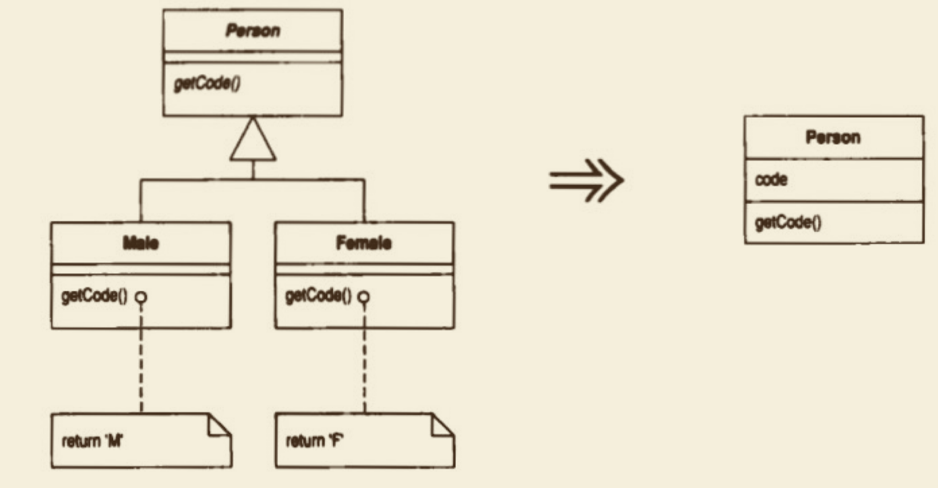
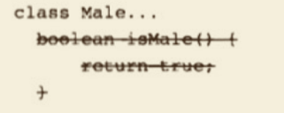

# Replace Subclass with Fields（以字段取代子类）
你的各个⼦类的唯⼀差别只在“返回常量数据”的函数身上。 


修改这些函数，使它们返回超类中的某个（新增）宇段，然后销毁⼦类。


## 动机

建⽴⼦类的⽬的，是为了增加新特性或变化其⾏为。有⼀种变化⾏为被称为“常最函数”（constant method）［Beck］，它们会返回⼀个硬编码的值。这东⻄有其⽤途：
你可以让不同的⼦类中的同⼀个访问函数返回不同的值。你可以在超类中将访问函 数声明为抽象函数，并在不同的⼦类中让它返回不同的值。
尽管常量函数有其⽤途，但若⼦类中只有常量函数，实在没有⾜够的存在价值。 你可以在超类中设计⼀个与常量函数返回值相应的字段，从⽽完全去除这样的⼦类。 如此⼀⽶就可以避免因继承⽽带来的额外复杂性。

## 做法

⼝ 对所有⼦类使⽤ Replace Constructor with Factory Method （304）。
⼝ 如果有任何代码直接引⽤⼦类，令它改⽽引⽤超类。 
⼝ 针对每个常量函数，在超类中声明⼀个final字段。 
⼝ 为超类声明⼀个protected构造函数，⽤以初始化这些新增字段。 
⼝ 新建或修改⼦类构造函数，使它调⽤超类的新增构造函数。
⼝ 编评，测试。
⼝ 在超类中实现所有常量函数，令它们返回相应字段值，然后将该函数从⼦类中删掉。
⼝ 每删除⼀个常量函数，编译并测试。
⼝ ⼦类中所有的常量函数都被删除后，使⽤Inline Method（117）将⼦类构造函数内联到超类的⼯⼚函数中。
⼝ 编译，测试。 
⼝ 将⼦类删掉。 
⼝ 编译，测试。
⼝ 重复“内联构造函数、删除⼦类”过程，直到所有⼦类都被删除。

## 范例

本例之中，我以Person表示“⼈”，并针对每种性别建⽴⼀个⼦类：
以Male⼦类表示“男⼈”，以 Female⼦类表示“⼥⼈”：
```java
abstract class Person {
    abstract boolean isMale();
    abstract char getCode();
}

class Male extends Person {
    boolean isMale() {
        return true;
    }
    char getCode() {
        return 'M';
    }
}

class Female extends Person {
    boolean isMale() {
        return false;
    }
    char getCode() {
        return 'F';
    }
}
```

在这⾥，两个⼦类之间唯⼀的区别就是：它们以不同的⽅式实现了 Person所声明的抽象函数 getCode()，
返回不同的硬编码常量（所以 getCode() 是个常量函数［Beck］）。我应该将这两个怠惰的⼦类去掉。

⾸先我需要使⽤ Replace Constructor with Factory Method （304）。
在这⾥，我需要 为每个⼦类建⽴⼀个⼯⼚函数： 
```java
class Person {
    static Person createMale() {
        return new Male();
    }
    static Person createFemale() {
        return new Female();
    }
}
```

然后我把对象创建过程从以下这样： 
`Person kent = new Male();`

改为这样：
`Person kent = Person.createMale();`

将所有调⽤构造函数的地⽅都改为调⽤⼯⼚函数之后，就不应该再有任何对⼦类的直接引⽤了。⼀次全⽂搜索就可以帮助我证实这⼀点。

然后，我可以把这两个⼦类都声明为 private，
这样，编译器就可以帮助我，保证⾄少包外不会有任何代码使⽤它们。 

现在，针对每个常量函数，在超类中声明⼀个对应的字段：
```java
class Person {
    private final boolean _isMale;
    private final char _code;
}
```
然后,为超类加上⼀个protected构造函数：
```java
class Person {
    private final boolean _isMale;
    private final char _code;
    protected Person(boolean isMale, char code) {
        _isMale = isMale;
        _code = code;
    }
}
```

再为⼦类加上新构造函数，令它调⽤超类新增的构造函数：
```java
class Male extends Person {
    Male() {
        super(true, 'M');
    }
}

class Female extends Person {
    Female() {
        super(false, 'F');
    }
}
```

完成这⼀步后，编译并测试。

所有字段都被创建出来，并被赋予初值，但到⽬前为⽌，我们还没有使⽤它们。
现在我可以在超类中加⼊访问这些字段的函数，并删掉⼦类中的常量函数，从⽽让这些字段粉墨登场：
```java
class Person {
    private final boolean _isMale;
    private final char _code;
    protected Person(boolean isMale, char code) {
        _isMale = isMale;
        _code = code;
    }
    
    boolean isMale() {
        return _isMale;
    }

    char getCode() {
        return _code;
    }
    
}
```



我可以逐⼀对每个字段、每个⼦类进⾏这⼀步骤的修改。
如果我相信⾃⼰的运⽓，也可以采取⼀次性全部修改的⼿段。

所有字段都处理完毕后，所有⼦类也都空空如也了，于是，可以删除 Person中 那个抽象函数的 abstract修饰符，
并以 Inline Method （117）将 ⼦类构造函数 内联到 超类的 ⼯⼚函数中：
```java
class Person {
    private final boolean _isMale;
    private final char _code;
    protected Person(boolean isMale, char code) {
        _isMale = isMale;
        _code = code;
    }
    
    boolean isMale() {
        return _isMale;
    }
    
    static Person createMale() {
        return new Person(true, 'M');
    }
    static Person createFemale() {
        return new Person(false, 'F');
    }
}

```

编译、测试后，我就可以删掉 Male类，并对 Female类 重复上述过程。

