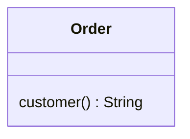
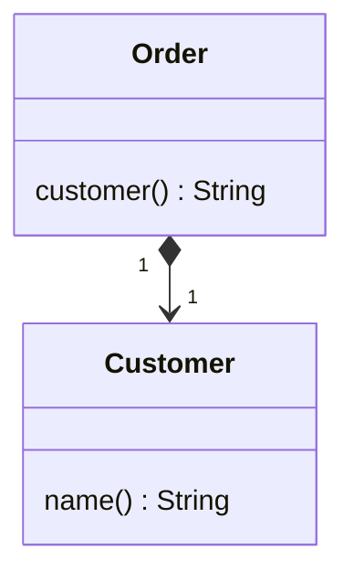

# 以对象取代数据值

你有⼀个数据项，需要与其他数据和⾏为⼀起使⽤才有意义。


将数据项变成对象。





## 动机
开发初期，你往往决定以简单的数据项表⽰简单的情况。
但是，随着开发的进⾏，你可能会发现，这些简单数据项不再那么简单了。
⽐如说，⼀开始你可能会⽤ ⼀个字符串 来表⽰“电话号码”概念，
但是，随后你就会发现，电话号码需要“格式化”、“抽取区号”之类的特殊⾏为。

如果，这样的数据项只有⼀两个，你还可以把相关函数放进数据项所属的对象⾥：
但是， Duplicate Code 坏味道 和 Feature Envy 坏味道，很快就会从代码中散发出来。
当这些坏味道开始出现，你就应该将 **数据值** 变成 **对象**。

## 做法
-[ ] 为待替换数值新建⼀个类，在其中声明⼀个final字段，其类型 和 源类中的待替换数值类型 ⼀样。
     然后，在新类中加⼊这个字段的取值函数，再加上⼀个接受此字段为参数的构造函数。
-[ ] 编译。
-[ ] 将源类中的待替换数值字段的类型改为前⾯新建的类。
-[ ] 修改源类中该字段的取值函数，令它调⽤新类的取值函数。
-[ ] 如果源类构造函数中⽤到这个待替换字段（多半是赋值动作），我们就修改构造函数，
     令它改⽤新类的构造函数来对字段进⾏赋值动作。
-[ ] 修改源类中待替换字段的设值函数，令它为新类创建⼀个实例。
-[ ] 编译，测试。
-[ ] 现在，你有可能需要对新类使⽤Change Value to Reference（179）。

## 范例
下⾯有⼀个代表“定单”的order类，其中以⼀个字符串记录定单客户。
现在，我希望改⽤⼀个对象来表示客户信息，这样就有充裕的弹性保存客户地址、信⽤等级等信息，也得以安置这些信息的操作⾏为。
Order类最初如下：

```java
class Order {
    private String _customer;
    public Order(String customer) {
        _customer = customer;
    }
    public String getCustomer() {
        return _customer;
    }
    public void setCustomer(String arg) {
        _customer = arg;
    }
}
```
使⽤order类的代码可能像下⾯这样：
```java
class Client {
    private static int numberOfOrdersFor(List<Order> orders, String customer) {
        int result = 0;
        for (Order order : orders) {
            if (order.getCustomer().equals(customer)) {
                result++;
            }
        }
        return result;
    }
}
```

⾸先，我要新建⼀个customer类 来表示 “客户”概念。
然后，在这个类中，建⽴⼀个final字段，⽤以保存⼀个字符串，这是order类⽬前所使⽤的。
我将这个新字段命名为_name，因为这个字符申的⽤途就是记录客户名称。
此外，我还要为这个字符串加上 取值函数 和 构造函数。

```java
class Customer {
    private final String _name;
    public Customer(String name) {
        _name = name;
    }
    public String getName() {
        return _name;
    }
}
```

现在，我要将order中的 _customer字段 的类型 修改为 Customer：
并修改所有引⽤该字段的函数，让它们恰当地改⽽引⽤customer对象。
其中，取值函数 和 构造函数 的修改都很简单。
⾄于 设值函数，我让它创建⼀个customer实例。

```java
class Order {
    private Customer _customer;
    public Order(String customer) {
        _customer = new Customer(customer);
    }
    public String getCustomer() {
        return _customer.getName();
    }
    public void setCustomer(String arg) {
        _customer = new Customer(arg);
    }
}
```

设值函数需要创建⼀个Customer实例，这是因为以前的字符串是个值对象（value object），所以现在的customer对象也应该是个值对象。
这也就意味每个Order对象都包含⾃⼰的⼀个Customer对象。
注意这样⼀条规则：值对象应该是不可修改内容的—这便可以避免⼀些讨厌的别名问题。
⽇后或许我会想让 Customer对象 成为 引⽤对象（reference object），但那是另⼀项重构⼿法的责任。
现在，我可以编译并测试了。 

我需要观察 Order类 中的 _customer字段 的操作函数，并作出⼀些修改，使它更好地反映出修改后的新形势。
对于取值函数，我会使⽤ Rename Method （273）改变其名称，让它更消晰地表示，它所返回的是消费者名称，⽽不是个Customer对象。
⾄于构造函数和设值函数，我就不必修改其签名了，但参数名称得改：
```java
class Order {
    private Customer _customer;
   
    // 使⽤ Rename Method （273）改变其名称，
    // 让它更消晰地表示，它所返回的是消费者名称，⽽不是个Customer对象
    public String getCustomerName() {
        return _customer.getName();
    }
    
    // ⾄于构造函数和设值函数，我就不必修改其签名了，但参数名称得改：
    public Order(String customer) {
        _customer = new Customer(customer);
    }
    public void setCustomer(String arg) {
        _customer = new Customer(arg);
    }
}
```
后继的其他重构，也许会添加 “接受现有Customer对象作为参数”的 构造函数 和 设值函数。 

本次重构到此为⽌。 但是，这个案例和其他很多案例⼀样，还需要⼀个后续步骤。
如果想在 Customer中 加⼊信⽤等级、地址之类的其他信息，现在还做不到，
因为，⽬前的 Customer 还是作为值对象对待的，每个 Order对象 ，都拥有⾃⼰的 Customer对象。
为了给 Customer类 加上信⽤等级、地址之类的属性，我必须运⽤Change Value to Reference（179），
这么⼀来，属于同⼀客户的所有 Order对象 就可以共享同⼀个 Customer对象了。
⻢上，你就可以看到这个例⼦。
