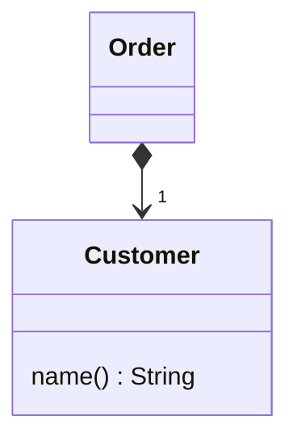
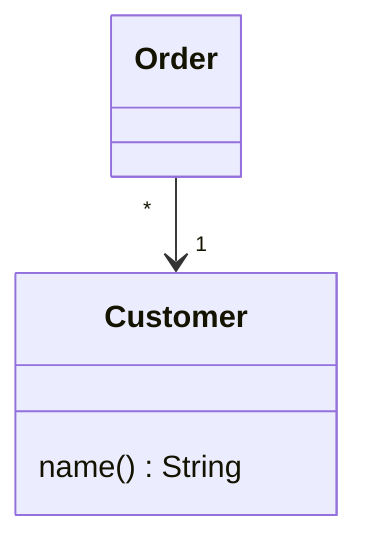

# 将值对象改为引用对象

你从⼀个类衍⽣出许多彼此相等的实例，希望将它们替换为同⼀个对象。 


将这个`值对象`变成`引⽤对象`。

值对象：


引用对象：



## 动机
在许多系统中，你都可以对对象做⼀个有⽤的分类：`引⽤对象` 和 `值对象`。

`引⽤对象`：就像 “客户”、“账户” 这样的东⻄，每个对象都代表真实世界中的⼀个实物，
你可以直接以相等操作符(==，⽤来检验对象同⼀性)检查两个对象是否相等。

`值对象`：则是像 “⽇期”、“钱” 这样的东⻄，它们完全由其所含的数据值来定义，
你并不在意副本的存在，系统中或许存在成百上千个内容为 “1/1/2000” 的 “⽇期”对象。
当然，你也需要知道两个值对象是否相等，所以，你需要覆写 `equals()` 以及 `hashCode()`。


要在 `引⽤对象` 和 `值对象` 之间做选择有时并不容易。
有时候，你会从⼀个简单的 `值对象` 开始，在其中保存少量不可修改的数据。
⽽后，你可能会希望给这个 `值对象` 加⼊⼀些 可修改数据，并确保对任何⼀个对象的修改，都能影响到所有引⽤此 `值对象` 的地⽅。
这时候，你就需要将这个 `值对象` 变成⼀个 `引⽤对象`。

## 做法

-[ ] 使⽤ Replace Constructor with Factory Method （304）.
-[ ] 编译，测试。
-[ ]  决定由什么对象负责提供访问新对象的途径。
> 可能是⼀个静态字典或⼀个注册表对象。
> 你也可以使⽤多个对象作为新对象的访问点。
-[ ]  决定这些引⽤对象应该预先创建好，或是应该动态创建。
> 如果这些引⽤对象是预先创建好的，⽽你必须从内存中将它们读取出来，
> 那么，就得确保它们在被需要的时侯能够被及时加载.
-[ ]  修改⼯⼚函数，令它返回引⽤对象。
> 今如果对象是预先创建好的，你就需要考虑：万⼀有⼈索求⼀个其实并不存 在的对象，要如何处理错误？  
> 你可能希望对⼯⼚函數使⽤ Rename Method（273），使其传达这样的信息： 它返回的是⼀个既存对象。

-[ ] 编译，测试。


## 范例

在Replace Data Valve with Object （175）⼀节中，我留下了⼀个重构后的程序，本节范例就从它开始。
我们有下列的Customer类：
```java
class Customer {
    private final String name;
    
    public Customer(String name) {
        this.name = name;
    }
    public String getName() {
        return name;
    }
}
```
它被以下的order类使⽤：
```java
class Order {
    private Customer customer;
    public Order(String customer) {
        this.customer = new Customer(customer);
    }
    public String getCustomer() {
        return customer.getName();
    }
    public void setCustomer(String arg) {
        customer = new Customer(arg);
    }
}
```

此外，还有⼀些代码也会使⽤customer对象：
```java
class Client {
    private static int numberOfOrdersFor(Collection orders, String customer) {
        int result = 0;
        Iterator iter = orders.iterator();
        while (iter.hasNext()) {
            Order each = (Order) iter.next();
            if (each.getCustomer().equals(customer))
                result++;
        }
        return result;
    }
}
```

到⽬前为⽌，Customer对象还是值对象。

就算多份定单属于同⼀客户，但每个order对象还是拥有各⾃的customer对象。
我希望改变这⼀现状，使得⼀旦同⼀客户拥有多份不同定单，
代表这些定单的所有order对象就可以共享同⼀个Customer对象。

本例中，这就意味着：每⼀个客户名称只该对应⼀个Customer对象。

⾸先，我使⽤ Replace Constructor with Factory Method（304）。
这样，我就可以控制Customer对象的创建过程，这在以后会是⾮常重要的。
我在Customer类中定义这个⼯⼚函数：
```java
class Customer {
    // 工厂函数
    public static Customer create(String name) {
        return new Customer(name);
    }

    private final String name;

    public Customer(String name) {
        this.name = name;
    }
}

```

然后，把原本调⽤ 构造函数 的地⽅，改为调⽤ ⼯⼚函数：
```java
class Order {
    private Customer customer;
    public Order(String customer) {
        this.customer = Customer.create(customer);
    }
    public String getCustomer() {
        return customer.getName();
    }
    public void setCustomer(String arg) {
        customer = Customer.create(arg);
    }
}
```

然后再把构造函数声明为private：
```java
class Customer {
    
    public static Customer create(String name) {
        return new Customer(name);
    }

    private final String name;

    private Customer(String name) {
        this.name = name;
    }
}
```
现在，我必须决定如何访问 Customer对象。
我⽐较喜欢通过另⼀个对象（例如order中的⼀个字段）来访问它。
但是，本例并没有这样⼀个明显的字段可⽤于访问customer对象。
在这种情况下，我通常会创建⼀个 注册表对象 来保存所有 customer对象，以此作为访问点。
为了简化我们的例⼦，我把这个注册表保存在 Customer类 的 static字段 中，让 customer类 作为访问点：
private static Dictionary _instances - new Hashtable（）；

然后，我得决定：
  应该在接到请求时，创建新的customer对象，还是应该 预先将它们创建好。  
这⾥，我选择后者。   
在应⽤程序的启动代码中，我先把需要使⽤的Customer对象加载妥当。
这些对象可能来⾃数据库，也可能来⾃⽂件。
为求简单起⻅，我在代码中明确⽣成这些对象。
反正，以后我总是可以使⽤ Substitute Algorithm（139）来改变它们的创建⽅式。
```java
class Customer {
    private static Dictionary _instances = new Hashtable();
    
    // 现在，我要修改⼯⼚函数，让它返回预先创建好的Customer对象：
    public static Customer create(String name) {
        return (Customer)_instances.get(name);
    }
    private final String name;
    private Customer(String name) {
        this.name = name;
    }
    
    private void store() {
        _instances.put(name, this);
    }
    
    static void loadCustomers() {
        new Customer("Lemon Car Hire").store();
        new Customer("Associated Coffee Machines").store();
        new Customer("Bilston Gasworks").store();
    }
    
}
```

由于 create() 总是返回既有的 Customer对象，
所以，我应该使⽤ Rename Method（273）修改这个⼯⼚函数的名称，以便强调这⼀点。
```java
class Customer {
    private static Dictionary _instances = new Hashtable();
    
    public static Customer getNamed(String name) {
        return (Customer)_instances.get(name);
    }
    private final String name;
    private Customer(String name) {
        this.name = name;
    }
    
    private void store() {
        _instances.put(name, this);
    }
    
    static void loadCustomers() {
        new Customer("Lemon Car Hire").store();
        new Customer("Associated Coffee Machines").store();
        new Customer("Bilston Gasworks").store();
    }
    
}
```