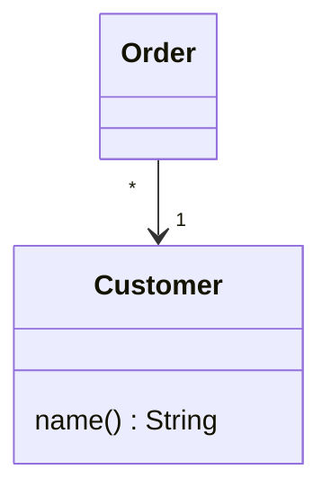
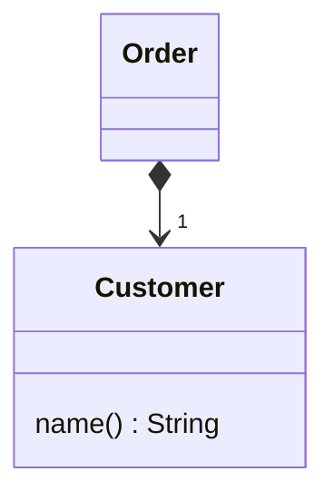

# 将引⽤对象改为值对象

你有⼀个引⽤对象，很⼩且不可变，⽽且不易管理。

## 示例
将它变成⼀个值对象。  

引用对象：


值对象：


## 动机

正如我在 Change Value to Reference（179）中所说，要在`引⽤对象`和`值对象`之间做选择，有时并不容易。  
作出选择后，你常会需要⼀条回头路。  

如果`引⽤对象`开始变得难以使⽤，也许就应该将它改为`值对象`。  
`引⽤对象`必须被某种⽅式控制，你总是必须向其控制者请求适当的`引⽤对象`。  
它们可能造成内存区域之间错综复杂的关联。

在分布系统和并发系统中，不可变的`值对象`特别有⽤，因为你⽆需考虑它们的同步问题。  

`值对象`有⼀个⾮常重要的特性：它们应该是 “不可变” 的。  
⽆论何时，只要你调⽤ 同⼀对象 的 同⼀个查询函数，都应该得到 同样结果。  
如果，保证了这⼀点，那么，就可以放⼼地以多个对象表示同⼀个事物。  
如果，`值对象`是可变的，你就必须确保 对某⼀对象的修改，会⾃动更新其他“代表相同事物”的对象。  
这太痛苦了，与其如此，还不如把它变成`引⽤对象`。  

这⾥，有必要澄清⼀下 “不可变”（immutable）的意思：  
如果，你以Money类，表示“钱”的概念，其中，有 “币种” 和 “⾦额” 两条信息，  
那么，Money对象 通常是⼀个不可变的`值对象`。  
这并⾮意味你的薪资不能改变，⽽是意味：  
如果要改变你的薪资，就需要使⽤ **另⼀个Money对象** 来取代 **现有的Money对象**，⽽不是在 **现有的Money对象** 上修改。  
**你** 和 **Money对象** 之间的关系可以改变，但 **Money对象** ⾃身不能改变。

### 个人笔记

引用对象， 是单例的;  

值对象， 是多例的；  
值对象的不可变体现在，重写的 equals()方法 和 hashCode()方法。

## 做法

- [ ] 检查重构⽬标是否为不可变对象，或是否可修改为不可变对象。
> • 如果该对象⽬前还不是不可变的，就使⽤ Remove Setting Method（300），直到它成为不可变的为⽌。   
> • 如果⽆法将该对象修改为不可变的，就放身使⽤本项重构。
- [ ] 建⽴ equals() 和 hashCode() 。
- [ ] 编译，测试。
- [ ] 考虑是否可以删除⼯⼚函数，并将构造函数声明为public。

## 范例

我们从⼀个表示“货币种类”的Currency类开始：
```java
class Currency {
    private String _code;
    public String getCode() { return _code; }
    private Currency(String code) { _code = code; }
}

```

这个类所做的就是保存并返回⼀个货币种类代码。它是⼀个引⽤对象，所以如 果要得到它的实例，必须这么做：
```java
Currency usd = Currency.get("USD");
```

Currency类维护⼀个包含所有currency实例的链表。
我不能直接使⽤构造函数创建实例，因为，Currency 构造函数 是 private的。
```java
public static void main(String[] args) {
    new Currency("USD").equals(new Currency("USD"));  // 返回false
}
```

要把⼀个`引⽤对象`变成`值对象`，关键动作是：检查它是否不可变。
如果不是，我就不能使⽤本项重构，因为 可变的值对象 会造成烦⼈的别名问题。
在这⾥，Currency对象是不可变的，所以，下⼀步就是为它定义`equals()`：
```java
@Override
public boolean equals(Object arg) {
    if (!(arg instanceof Currency other)) 
        return false;
    return _code.equals(other._code);
}

```

定义了`equals()`，就必须同时定义 `hashCode()`。
实现 `hashCode()`有个简单办法：读取`equals()`使⽤的所有字段的hash码，然后对它们进⾏ 按位异或（^）操作。
本例中，这很容易实现，因为`equals()`只使⽤了⼀个字段：
```java
@Override
public int hashCode() {
    return _code.hashCode();
}

```

完成这两个函数后，我可以编译并测试。
这两个函数的修改必须同时进⾏，否则依赖hash的任何集合对象（例如Hashtable、HashSet和HashMap）都可能会产⽣意外⾏为。

现在，我想创建多少个等值的 Currency对象就可以创建多少个。
我还可以把构造函数声明为public，直接以构造函数获取Currency实例，从⽽去掉Currency 类中的 ⼯⼚函数 和 控制实例创建的⾏为。

```java
public static void main(String[] args) {
    new Currency("USD").equals(new Currency("USD"));  // 现在返回true    
}
```
