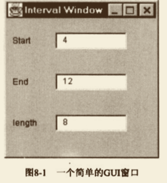

# Duplicate Observed Data  复制“被监视数据”

你有⼀些 领域数据 置身于GUI控件中，⽽ 领域函数 需要访问这些数据。 

将该数据复制到⼀个领域对象中。建⽴⼀个Observer模式，⽤以同步 领域对象 和 GUI对象内的重复数据。

[uml图](file/gui.puml)

## 动机

⼀个分层良好的系统，应该将处理⽤户界⾯和处理业务逻辑的代码分开。
之所以这样做，原因有以下⼏点：
（1）你可能需要使⽤不同的⽤户界⾯，来表现相同的业务逻辑，如果同时承担两种责任，⽤户界⾯会变得过分复杂；
（2）与GUI隔离之后，领域对象的维护和演化都会更容易，你甚⾄可以让不同的开发者负责不同部分的开发。

尽管可以轻松地将“⾏为”划分到不同部位，“数据” 却往往不能如此。
同⼀项数据有可能既需要内嵌于GUI控件，也需要保存于领域模型⾥。  
⾃从MVC （Model-View-Controller，模型-视图—控制器）模式出现后，
⽤户界⾯框架都使⽤多层系统来提供某种机制，使你不但可以提供这类数据，并保持它们同步。

如果你遇到的代码是以两层⽅式开发，业务逻辑被内嵌于⽤户界⾯之中，你就有必要将⾏为分离出来。
其中的主要⼯作就是 函数的分解 和 搬移。
但数据就不同了：你不能仅仅只是移动数据，必须将它**复制**到新的对象中，并提供相应的**同步机制**。

## 做法

-[ ]  修改展现类(GUI)，使其成为领域类的 Observer［GoF］。
>如果尚来有领域类，就建⽴⼀个。  

>如果没有“从展现类到领域类”的关联，就将领域类保存⼦展现类的⼀个 字段中.

-[ ]  针对GUI类中的领域数据，使⽤ Self Encapsulate Field （171）。

-[ ]  编译，测试。 

-[ ]  在事件处理函数中，调⽤ 设值函数，直接更新GUI组件。
>在事件处理函数中，放⼀个设值函数，利⽤它，将 GUI组件 更新为 领城数据的当前值。
这一步看起来似乎没有必要，你只不过是拿GUI的值设定GUI⾃⼰。
然而实际上，就是这样的设值函数，才使（GUI组件的）任何动作 得以于⽇后被（领域对象）执⾏起来；这是这⼀步骤的意义所在。

>进⾏这个改变时，对于组件，不要使⽤取值函数，应该直接取⽤
>因为，稍后我们将修改取值函数，使其从领域对象（⽽⾮GUI组件）取值。设值函数也将做类似修改。

>确保测试代码能够触发新添加的事件处理机制。

-[ ]  编译，测试。

-[ ]  在领域类中，定义数据及其相关访问函数。

>确保 领域类 中的 设值函数 ，能够触发 Observer模式 的 通报机制。

>对于在领域类中被观察的数据，使⽤ 与 展现类所⽤的相同类型（通常是字符串）来保存；
 后续重构中，你可以⾃由改变这个数据类型.

-[ ]  修改 展现类 中的 访问函数，将它们的目标操作对象 改为 领域对象（⽽⾮GUI组件）。 

-[ ]  修改 Observer的 update()，使其从相应的 领域对象中，将所需数据 复制(同步)给 GUI组件。

-[ ]  编译，测试。

## 范例
我们的范例从图8-1所示窗⼝开始。

其⾏为⾮常简单：当⽤户修改⽂本框中的数值，另两个⽂本框就会⾃动更新。

如果你修改 Start 或 End，Length 就会⾃动成为两者计算所得的⻓度;
如果你修改 Length， End 就会随之变动。

[IntervalWindow.java](demo2/IntervalWindow.java)

## 使⽤事件监听器

如果你使⽤ 事件监听器 ⽽不是Observer/Observable模式，仍然可以实施 Duplicate Observed Data（189）。
这种情况下，你需要在 领域模型 中，建⽴⼀个 监听器类 和⼀个 事件类（如果你不在意依赖关系的话，也可以使⽤AWT类）。
然后，你需要对 领域对象 注册 监听器，就像前例对 observable对象 注册 observer⼀样。
每当 领域对象 发⽣变化（类似上例的 update() 函数被调⽤），就向 监听器 发送⼀个事件。
IntervalWindow 可以利⽤⼀个内嵌类来实现监听器接⼝，并在适当时候，调⽤适当的 update()函数。
