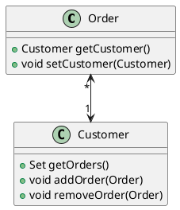

# Change Unidirectional Association to Bidirectional（将单向关联改为双向关联）

两个类都需要使⽤对⽅特性，但其间只有⼀条单向连接。 


添加⼀个 反向指针，并使 修改函数(指，改变双方关系的函数) 能够同时更新 两条连接。





## 动机

&emsp;&emsp;&emsp;&emsp;&emsp;&emsp;
开发初期，你可能会在两个类之间建⽴⼀条 单向连接，使其中 ⼀个类 可以引⽤ 另⼀个类。
随着时间推移，你可能发现，被引⽤类 需要得到 其引⽤者 以便进⾏某些处理。
也就是说，它需要⼀个反向指针。
但指针是⼀种单向连接，你不可能反向操作它。 
通常，你可以绕道⽽⾏，虽然会耗费⼀些计算时间，成本还算合理，然后你可以在被引⽤类中建⽴⼀个函数专⻔负责此⼀⾏为。
但是，有时候想绕过这个问题并不容易，此时，就需要建⽴双向引⽤关系，或称为 反向指针。
如果使⽤不当，反向指针 很容易造成混乱；
但只要你习惯了这种⼿法，它们其实并不是太复杂。

&emsp;&emsp;&emsp;&emsp;&emsp;&emsp;
“反向指针”⼿法有点棘⼿，所以，在你能够⾃如运⽤之前，应该有相应的测试。 
通常，我不花⼼思去测试访问函数，因为 普通访问函数 的⻛险 没有⾼到需要测试的地步，
但本重构，要求测试访问函数，所以，它是极少数需要 添加测试 的 重构⼿法之⼀。

&emsp;&emsp;&emsp;&emsp;&emsp;&emsp;
本重构运⽤ 反向指针 实现 双向关联。
其他技术（例如连接对象）需要其他重构⼿法。


## 做法
-[ ] 在被引⽤类中增加⼀个字段，⽤以保存反向指针。 
-[ ] 决定由哪个类——引⽤端还是被引⽤端——控制关联关系。
-[ ] 在被控端建⽴⼀个辅助函数，其命名应该清楚指出它的有限⽤途。 
-[ ] 如果既有的修改函数在控制端，让它负责更新反向指针。 
-[ ] 如果既有的修改函数在被控端，就在控制端建⽴⼀个控制函数，并让既有的 修改函数 调⽤这个新建的 控制函数。

## 范例
下⾯是⼀段简单程序，其中有两个类：表示“订单”的 order 和 表示“客户” 的 Customer。  
Order 引⽤了 Customer，Customer 并没有引⽤ order:  

```java
class Order{
     private Customer _customer;
     public Customer getCustomer(){
          return _customer;
     }
     public void setCustomer(Customer arg){
          _customer = arg;
     }    
}

```

⾸先，我要为Customer添加⼀个字段。
由于⼀个客户可以拥有多份定单，所以这个新增字段应该是个集合。
我不希望同⼀份定单在同⼀个集合中出现⼀次以上， 所以这⾥适合使⽤set：
```java
class Customer{
     private Set _orders = new HashSet();
     
     public Set getOrders(){
          return _orders;
     }
     public void addOrder(Order arg){
          _orders.add(arg);
     }
     public void removeOrder(Order arg){
          _orders.remove(arg);
     }
}
```

现在，我需要决定由哪⼀个类负责控制关联关系。  
我⽐较喜欢让单个类来操控，因为，这样就可以将所有处理关联关系的逻辑集中安置于⼀地。  
我将按照下列步骤做出这⼀决定。
1. 如果两者都是引⽤对象，⽽其间的关联是“⼀对多”关系，那么，就由 “拥有单⼀引用” 的那⼀⽅承担 “控制者”⻆⾊。
   以本例⽽⾔，如果 ⼀个客户 可拥有 多份定单，那么，就由 order类（订单）来控制 关联关系。
2. 如果 某个对象 是 组成另⼀对象的部件，那么，由后者负责控制关联关系。
3. 如果两者都是引⽤对象，⽽其间的关联是“多对多”关系，那么，随便其中哪个对象来控制关联关系，都⽆所谓。

&emsp;&emsp;&emsp;&emsp;&emsp;&emsp;
本例之中，由于order负责控制关联关系，所以，我必须为 Customer 添加⼀个 辅助函数，让 Order 可以直接访问 _orders集合。
Order的修改函数，将使⽤这个 辅助函数 对 指针两端对象 进⾏ 同步控制。  
&emsp;&emsp;&emsp;&emsp;&emsp;&emsp;
我将这个辅助函数命名为 `friendOrders()` ，表示这个函数只能在这种特情况下使⽤。
此外，如果 Order 和 customer 位在同⼀个包内，我还会将 friendOrders() 声明为包内可⻅，使其可⻅程度降到量低。
但，如果这两个类不在同⼀个包内，我就只好把 friendOrders() 声明为 public了。

```java
class Customer{
    
     private Set _orders = new HashSet();
     
     // 1) 如果你希望在customer中也能修改连接，就让它调⽤控制函数：
     // 2) 如果⼀份定单也可以对应多个客户，那么你所⾯临的就是⼀个“多对多”情况，重构后的函数可能是下⾯这样：
     public void addOrder(Order arg){
          _orders.add(arg);
     }
     public void removeOrder(Order arg){
          _orders.remove(arg);
     }
     
     /** should only be used by Order when modifying the association */
     Set friendOrders(){
          return _orders;
     }
}

```

现在，我要改变修改函数，令它同时更新反向指针：
```java
class Order{
     private Customer _customer;
     
     public Customer getCustomer(){
          return _customer;
     }
     
     public void setCustomer(Customer arg){
         
          if(_customer != null){
               _customer.friendOrders().remove(this);
          }
          
          _customer = arg;
          
          if(_customer != null){
               _customer.friendOrders().add(this);
          }
          
     }
}

```

类之间的关联关系是各式各样的，因此，修改函数的代码也会随之有所差异。
如果 _customer的值 不可能是null，那么，可以拿掉上述的第⼀个 null 检查，但仍然 需要检查传⼊参数是否为nu11。
不过，基本形式总是相同的：
- 先让对⽅删除指向你的指针，
- 再将，你的指针指向⼀个新对象，
- 最后，让那个新对象把它的指针指向你。


## 总结
&emsp;&emsp;&emsp;&emsp;&emsp;&emsp;
当两个类都需要对方的特性时，可以使用 双向关联。
有两个类，分别为 订单Order 和 客户Customer；
Order 引用了 Customer，Customer 也需要引用 Order 来查看其所有订单详情。

&emsp;&emsp;&emsp;&emsp;&emsp;&emsp;
注意到，这里让 Customer 类 来控制 关联关系。
有以下原则，来决定哪个类来控制关联关系: 
1）如果某个对象是组成另一个对象的部件，那么由后者负责控制关联关系；
2）如果是一对多关系，则由单一引用那一方来控制关联关系。


