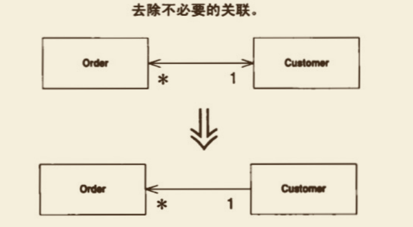

# Change Bidirectional Association to Unidirectional （将双向关联改为单向关联）
两个类之间有双向关联，但其中⼀个类如今不再需要另⼀个类的特性。



## 动机

双向关联很有⽤，但你也必须为它付出代价，那就是维护双向连接、确保对象 被正确创建和删除⽽增加的复杂度。
⽽且，由于很多程序员并不习惯使⽤双向关联，它往往成为错误之源。
⼤量的双向连接也很容易造成“僵⼫对象”：某个对象本来已经该死亡了，却仍然保留在系统中，因为对它的引⽤还没有完全清除。 
此外，双向关联也迫使两个类之间有了依赖：对其中任⼀个类的任何修改，都可能引发另⼀个类的变化。
如果这两个类位于不同的包，这种依赖就是包与包之间的相依。
过多的跨包依赖会造就紧耦合系统，使得任何⼀点⼩⼩改动都可能造成许 多⽆法预知的后果。

只有在真正需要双向关联的时候，才应该使⽤它。
如果发现双向关联不再有存在价值，就应该去掉其中不必要的⼀条关联。


## 做法

-[ ] 找出保存“你想去除的指针”的字段，检查它的每⼀个⽤户，判断是否可以去除该指针。 
> 不但要检查直接访问点，也要检查调⽤这些直接访问点的函数。  

> 考虑有⽆可能不通过指针取得被引⽤对象。    
  如果有可能，你就可以对取值函数使⽤ Substitute Algorithm（139），从⽽让客户在没有指针的情况下也可以使⽤该取值函数。   

> 对于使⽤该字段的所有函教，考虑将被引⽤对象作为参数传进去。

-[ ] 如果客户使⽤了取值函数，先运⽤Self Encapsulate Field（171）将待删除字段 ⾃我封装起来，
然后使⽤Substitute Algorithm（139）对付取值函数，令它不再使⽤该字段。
然后编译、测试。 

-[ ]  如果客户并未使⽤取值函数，那就直接修改待删除字段的所有被引⽤点：改 以其他途径获得该字段所保存的对象。每次修改后，编译并测试。 

-[ ]  如果已经没有任何函数使⽤待删除字段，移除所有对该字段的更新逻辑，然 后移除该字段。

> 如果有许多地⽅对此字段赋值，先运⽤ Self Encapsulate Field （171）使这些地点改⽤同⼀个设值函数。  
编译、测试。  
⽽后将这个设值函数的本体清空。   
再编译、再测试。  
如果这些都可⾏，就可以将此字段和其设值函数，连同对设值函数的所有调⽤，全部移除。

-[ ] 编译，测试。

## 范例

本例从 Change Unidirectional Association to Bidirectional （197）留下的代码开始进⾏，
其中，Customer 和 order 之间 有双向关联：

```java
class Order {
    
    private Customer customer;

    public void setCustomer(Customer arg) {
        if (customer != null) {
            customer.friendOrders().remove(this);
        }
        customer = arg;
        if (customer != null) {
            customer.friendOrders().add(this);
        }
    }
    
    public Customer getCustomer() {
        return customer;
    }
}
```

```java
class Customer {
    private Set orders = new HashSet();

    Set friendOrders() {
        /* should only be used by Order */
        return orders;
    }

    void addOrder(Order arg) {
        arg.setCustomer(this);
    }
    
}
```

后来我发现，除⾮先有 customer对象，否则不会存在 Order对象。
因此，我想将 从Order到Customer的连接 移除掉。
对于本项重构来说，最困难的就是检查可⾏性。
如果我知道本项重构是安全的，那么重构⼿法⾃身⼗分简单。
问题在于是否有任何代码依赖_customer字段存在。 
如果确实有，那么在删除这个字段之后，必须提供替代品。

⾸先，我需要研究所有读取这个字段的函数，以及所有使⽤这些函数的函数。 
我能找到另⼀条途径来提供customer对象吗？这通常意味着，将Customer对象作为参数传递给⽤户。
下⾯是⼀个简化例⼦：
```java
class Order {
    double getDiscountedPrice() {
        return getGrossPrice() * (1 - customer.getDiscount());
    }
}
```
改变为：
```java
class Order {
    double getDiscountedPrice(Customer customer) {
        return getGrossPrice() * (1 - customer.getDiscount());
    }
}
```

如果，待改变函数是被Customer对象调⽤的，那么，这样的修改⽅案特别容易实施，
因为，Customer对象将⾃⼰作为参数传给函数很容易。
所以，下列代码：
```java

class Customer {
   double getPriceFor(Order order) {
      Assert.isTrue(orders.contains(order)); // see Introduction Assertion
      return order.getDiscountedPrice();
   }
}
```
变成了：
```java
class Customer {
   double getPriceFor(Order order) {
      Assert.isTrue(orders.contains(order)); // see Introduction Assertion
      return order.getDiscountedPrice(this);
   }
}
```

另⼀种做法就是:
修改Order中的取值函数 getCustomer()，使其在不使⽤ _customer字段 的前提下，返回⼀个Customer对象。
如果这⾏得通，就可以使⽤ Substitute Algorithm （139）修改 order.getCustomer()函数算法。
我有可能这样修改代码：
```java
Customer getCustomer() {
    Iterator<Customer> iter = Customer.getInstances().iterator();
    while (iter.hasNext()) {
        Customer each = iter.next();
        if (each.containsOrder(this)) 
            return each;
    }
    return null;
}
```


这段代码⽐较慢，不过确实可⾏。
⽽且，在数据库环境下，如果我需要使⽤数据库查询语句，这段代码对系统性能的影响可能并不显著。
如果 order 类中，有些函数使⽤ _customer字段，我可以实施 Self Encapsulate Field （171）令它们转⽽改⽤上述的 getCustomer()函数。
如果我要保留上述的取值函数，那么 Order 和 customer 的关联从接⼝上看虽仍是双向的，但实现上已经是单向关系了。
虽然我移除了反向指针，但两个类彼此之间的依赖关系仍然存在。
既然要替换取值函数，那么我就专注地替换它，其他部分留待以后处理。
我会 逐⼀修改 取值函数的调⽤者，让它们通过其他来源取得customer对象。
每次修改 后都编译并测试。
实际⼯作中这⼀过程往往相当快。
如果这个过程让我觉得很棘⼿很复杂，我会放弃本项重构。
⼀旦消除了_customer字段的所有读取点，我就可以着⼿处理对此字段赋值的函数了。
很简单，只要把这些赋值动作全部移除，再把字段⼀并删除就⾏了。
由于已经没有任何代码需要这个字段，所以，删掉它并不会带来任何影啊。