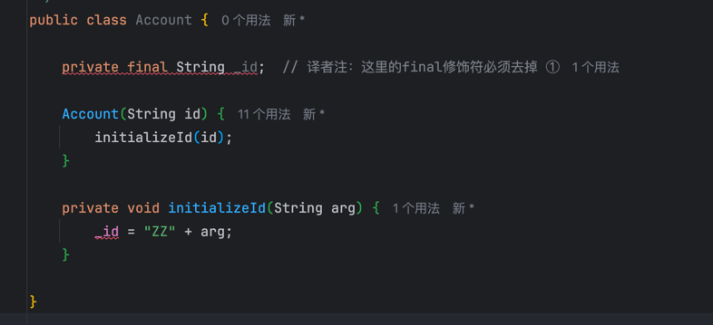

# Remove Setting Method（移除设值函数）
类中的某个字段应该在对象创建时被设值，然后就不再改变。 

去掉该字段的所有设值函数。


```puml
class Employee{
  setImmutableValue()
}
```

```puml
class Employee{
}
```

## 动机

如果你为某个字段提供了设值函数，这就暗⽰这个字段值可以被改变。
如果你不希望在对象创建之后此字段还有机会被改变，那就不要为它提供设值函数（同时，将该字段设为`final`）。
这样，你的意图会更加清晰，并且可以排除其值被修改的可能性————这种可能性往往是⾮常⼤的。

如果你保留了 间接访问变量 的⽅法，就可能经常有程序员 盲⽬使⽤它们［Beck］。
这些⼈甚⾄会在构造函数中使⽤设值函数！
我猜想，他们或许是为了代码的⼀致性，但却忽视了 设值函数往后可能带来的混淆。

## 做法

-[ ] 检查设值函数被使⽤的情况，看它是否只被构造函数调⽤，或者被构造函数 所调⽤的另⼀个函数调⽤。
-[ ] 修改构造函数，使其直接访问设值函数所针对的那个变量。
> 如果，某个⼦类，通过设值函数 给 超类的某个private字段 设了值，那么，你就不能这样修改。
> 这种情况下，你应该试着，在超类中，提供⼀个 protected函数（最好是构造函数）来给这些字段设值。
> 不论你怎么做，都不要给超类中的函数 起⼀个 与设值函数混淆 的名字。
-[ ] 编译，测试。 
-[ ] 移除这个设值函数，将它所针对的字段设为 final。
     ① 本步骤必须在本重构的最后进⾏，详情请看 http://www.refactoring.com/catalog/removeSettingMethod.html 和稍后的译者注。— 译者注
-[ ] 编译，测试。


## 范例

下⾯是⼀个简单例⼦：
```java
class Account{
  private String _id;
  Account(String id){
    setId(id);
  }
  
  void setId(String id){
    _id = id;
  }
  
}
```

以上代码可修改为：
```java
class Account{
    
  private final String _id;
  
  Account(String id){
    _id = id;
  }
  
}
```

问题可能以⼏种不同的形式出现。
⾸先，你可能会在设值函数中对传⼊参数做运算：
```java
class Account {
     private String _id;
     Account(String id) {
          setId(id);
     }

     void setId(String id) {
          _id = "ID" + id;
     }
}
```

如果对参数的运算很简单（就像上⾯这样）⽽且⼜只有⼀个构造函数，我可以直接在构造函数中做相同的修改。
如果修改很复杂，或者有⼀个以上的函数调⽤它，就需要提供⼀个独⽴函数。
我需要为新函数起个好名字，清楚表达该函数的⽤途：
```java
class Account {
    
     // private final String _id;  
     // 译者注：这里的final修饰符必须去掉 ①

     private String _id;

     Account(String id) {
          initializeId(id);
     }

     private void initializeId(String id) {
          _id = "ID" + id;
     }

}
```
① 此时，不能将独⽴函数中要赋值的字段（即，此处的 _id 字段）声明为 `final`，否则，不能通过编译。
因此，这⼀段所描述的 重构⼿法 实际上并不成⽴；
Account对象 在重构后，仍然是 可变对象，唯⼀能够得到的好处是：
通过修改 设值函数 的名称，可以让读者明⽩ initializeId()函数 只应该⽤于 对象 构造阶段。
——译者注



如果，⼦类 需要对 超类的 private变量赋初值，情况就⽐较麻烦⼀些：
```java
class InterestAccount extends Account {

    private double _interestRate;

    InterestAccount(String id, double rate) {
        setId(id);
        _interestRate = rate;
    }

}

class Account {
     private String _id;
     Account(String id) {
          setId(id);
     }

     void setId(String id) {
          _id = "ID" + id;
     }
}
```

问题是，我⽆法在 InterestAccount() 构造函数中，直接访问id变量。
最好的解决办法就是，使⽤超类构造函数：
```java
class InterestAccount extends Account {

     private double _interestRate;

     InterestAccount(String id, double rate) {
          super(id);
          _interestRate = rate;
     }

}

class Account {
     
    private String _id;
    
    Account(String id) {
        initializeId(id);
    }
    
    private void initializeId(String id) {
        _id = "ID" + id;
    }

}
```

如果不能那样做(如，超类没有 id构造函数)，那么，使⽤⼀个命名良好的函数就是最好的选择：
```java
class InterestAccount extends Account {
    
     private double _interestRate;

     InterestAccount(String id, double rate) {
          initializeId(id);
          _interestRate = rate;
     }
}

class Account {
    
     private String _id;

     Account() {
     }

     void initializeId(String id) {
          _id = "ID" + id;
     }

}
```


另⼀种需要考虑的情况就是，对⼀个集合设值：
```java
class Person {

     private Vector<Course> _courses;

     Vector<Course> getCourses() {
          return _courses;
     }

     void setCourses(Vector<Course> arg) {
          _courses = arg;
     }
     
}
```

在这⾥，我希望将 ‘设值函数’ setCourses()， 替换为 ‘add操作’ 和 ‘remove操作’ 。
我已经在 Encapsulate Collection（208）中，谈到了这⼀点。

```java
class Person {

     private Vector<Course> _courses;

     Vector<Course> getCourses() {
          return _courses;
     }
     
     void addCourse(Course arg) {
          _courses.add(arg);
     }

     void removeCourse(Course arg) {
          _courses.remove(arg);
     }
     
}
```