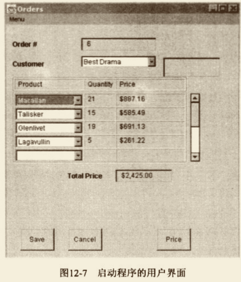

# Separate Domain from Presentation（将领域和表述/显示分离）

某些GUI类之中包含了领域逻辑。 

将领域逻辑分离出来，为它们建⽴独⽴的领域类。
```puml
class OderWindow
```
```puml
class OrderWindow{
}

OrderWindow -right-> Order
```


## 动机

提到⾯向对象，就不能不提 MVC（模型-视图-控制器）模式。
在Smalltalk-80 环境中，⼈们以此模式，维护 GUI（图形⽤户界⾯）和 领域对象 间的关系。

MVC模式最核⼼的价值在于：
它将⽤户界⾯代码（即视图：亦即现今常说的“展 现层”）和领域逻辑（即模型）分离了。
展现类 只含⽤以处理⽤户界⾯的逻辑；
领域类 不含任何与程序外观相关的代码，只含业务逻辑相关代码。
将程序中这两块复杂的部分加以分离，程序未来的修改将变得更加容易，同时也使同⼀业务逻辑的多种展现⽅式成为可能。
那些熟悉⾯向对象技术的程序员会毫不犹豫地在他们的程序中进⾏这种分离，并且，这种做法也的确证实了它⾃身的价值。

但是，⼤多数⼈并没有在设计中采⽤这种⽅式来处理GUI。
⼤多数 客户端/服务器结构的GUI应⽤，都采⽤双层逻辑设计：数据保存在数据库中，业务逻辑放在展现类中。
这样的环境往往追使你也倾向这种⻛格的设计，使你很难把业务逻辑放在其他地⽅。

Java是⼀个真正意义上的⾯向对象环境，因此你可以创建 内含业务逻辑的、与展现逻辑⽆关的领域对象。
但，你还是会经常遇到上述双层⻛格写就的程序。

## 做法

⼝ 为每个窗⼝建⽴⼀个领域类。 
⼝ 如果窗⼝内有⼀张表格，新建⼀个类来表示其中的⾏，再以窗⼝所对应之领 域类中的⼀个集合来容纳所有的⾏领域对象。
⼝ 检查窗⼝中的数据。如果数据只被⽤于UI，就把它留着；
   如果数据被领域逻辑使⽤，⽽且不显示于窗⼝上，我们就以 Move Field（146）将它搬移到领城类中；
   如果数据同时被UI和领域逻辑使⽤，就对它实施 Duplicate Observed Data（189），使它同时存在于两处，并保持两处之间的同步。
⼝ 检查展现类中的逻辑。实施Extract Method （110）将展现逻辑从领域逻辑中分 开。⼀旦隔离了领域逻辑，再运⽤Move Method（142）将它移到领域类。
⼝ 以上步骤完成后，你就拥有了两组彼此分离的类：展现类⽤以处理GUI，领域类包含所有业务逻辑。
   此时的领域类组织可能还不够严谨，更进⼀步的重构将解决这些问题。


## 范例

下⾯是⼀个商品订购程序。
其GUI如图12-7所示，其展现类与图12-8所示的关系数据库互动。
所有⾏为（包括GU1和定单处理）都由OrderWindow类处理。 
⾸先，建⽴⼀个order类表示“定单”。
然后，把order和orderWindow联系起来，如图12-9。

由于窗⼝中有⼀个⽤以显示定单的表格，所以我们还得建⽴⼀个 OrderLine，⽤以表示表格中的每⼀⾏。

我们将从窗⼝这边⽽不是从数据库那边开始重构。
当然，⼀开始就把领域模型建⽴在数据库基础上，也是⼀种合理策略，但我们最⼤的⻛险源于展现逻辑和领域逻辑之间的混淆，
因此我们⾸先基于窗⼝将这些分离出来，然后再考虑对其他地⽅进⾏重构。

⾯对这⼀类程序，在窗⼝中寻找内嵌的 SQL（结构化查询语⾔）语句，会对你有所帮助，
因为，SQL语句获取的数据⼀定是领域数据。


最容易处理的领域数据就是那些不直接显示于GUI者。
本例数据库的Customers 表中有⼀个codes字段，它并不直接显示于GUI，
⽽是被转换为⼀个更容易被⼈理解的短语之后再显示。

程序中以简单类型（例如string）保存这个字段值，⽽⾮将其放在AWT组件中。
我们可以安全地使⽤Move Field （146）将这个字段移到领域类。

&emsp;&emsp;&emsp;&emsp;&emsp;&emsp;
对于其他字段，我们就没有这么幸运了，因为它们内含AWT组件，既显示于窗⼝，也被领域对象使⽤。
⾯对这些字段，我们需要使⽤Duplicate Observed Data （189），把⼀个领域字段放进order类，
同时把⼀个相应的AWT字段放进orderWindow类。 
这是⼀个缓慢的过程，但最终我们还是可以把所有领域逻辑字段都搬到领域类。 
进⾏这⼀步骤时，你可以试着把所有SQL调⽤都移到领域类，这样你就是同时移动了数据库逻辑和领域数据。
最后，你可以在 OrderWindow 中，移除 import java.sql 之类的语句，这就表示我们的重构告⼀段落了。

在此阶段中你可能需要⼤量运⽤ Extract Method（110）和 Move Method（142）。

```puml

entity "Customers" as customers {
  *CustomerID : Number <<generated>>
  --
  Name : text
  Code : text
}

entity "Order" as order {
  *OrderID : Number <<generated>>
  --
  *CustomerID : Number <<FK>>
  Amount : Number
}

entity "OrderLines" as order_lines {
  *OrderID : number <<FK>>
  *ProductID : number <<FK>>
  Quantity : Number
  Amount: Number
}

entity "Products" as products {
  *ProductID : Number <<FK>>
  name : Text
  Threshold1: Number
  Price1: Number
  Threshold2: Number
  Price2: Number
  Threshold3: Number
  Price3: Number
  Threshold4: Number
  Price4: Number
}

customers ||..o{ order
order ||.right.o{ order_lines
order_lines }o.right.|| products

```

现在，我们拥有的3个类，如图12-10所⽰，它们离“组织良好”还有很⼤的距离。
```puml
class OrderWindow{
}

class Order{
ID
customerName
amount
customerCodes
}

class OrderLine{
productName
quantity
price
}

OrderWindow -right->"1" Order
Order -down->"*" OrderLine
```

不过，这个模型的确已经很好地分离了 展现逻辑 和 领域逻辑。
本项重构的进⾏过程中，你必须时刻留⼼风险来⾃何⽅。
如果 “展现逻辑 和 领域逻辑混淆” 是最⼤风险，那么，就先把它们完全分开，然后才做其他⼯作；
如果，其他⽅⾯的事情（例如产品定价策略）更重要，那么，就先把那⼀部分的逻辑从窗⼝提炼出来，并围绕着这个⾼⻛险部分进⾏重构，为它建⽴合适的结构。
反正，领域逻辑早晚都必须从窗⼝移出，如果你在处理⾼⻛险部分的重构时，会遗留某些逻辑于窗⼝之中，没关系，你可以稍后再来收拾它。